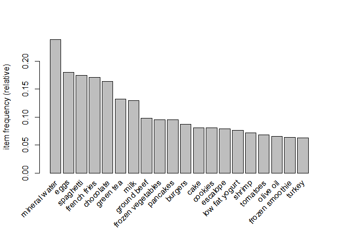

Association Rule Learning models: Apriori and Eclat

Apriori-----------------------------------------------------------------------------------------------------
Apriori algorithm has 3 parts- Support, Confidence and Lift

-> Support example(Market basket optimization) : #Transactions containing I/ # Transactions
-> Confidence example(Market basket optimization) i1->i2:# Transactions containing i1 and i2/# Transactions containing i1
-> Lift example(Market basket optimization) i1->i2: Confidence(i1->i2)/support(i2)

Apriori Algorithm
Step 1: Set a minimum support and confidence
Step 2: Take all the subsets in transactions having higher support than minimum support
Step 3: Take all the rules of these subsets having higher confidence than minimum confidence
Step 4: Sort the rules by decreasing Lift


```r
# Apriori

# import the dataset
# The first line of the dataset is not header
dataset=read.csv('Market_Basket_Optimisation.csv',header = FALSE)

# Transform dataset to sparse matrix for input
#install.packages('arules')
library(arules)
```

```
## Loading required package: Matrix
```

```
## 
## Attaching package: 'arules'
```

```
## The following objects are masked from 'package:base':
## 
##     abbreviate, write
```

```r
dataset=read.transactions('Market_Basket_Optimisation.csv',sep=',',rm.duplicates=TRUE)
```

```
## distribution of transactions with duplicates:
## 1 
## 5
```

```r
summary(dataset)
```

```
## transactions as itemMatrix in sparse format with
##  7501 rows (elements/itemsets/transactions) and
##  119 columns (items) and a density of 0.03288973 
## 
## most frequent items:
## mineral water          eggs     spaghetti  french fries     chocolate 
##          1788          1348          1306          1282          1229 
##       (Other) 
##         22405 
## 
## element (itemset/transaction) length distribution:
## sizes
##    1    2    3    4    5    6    7    8    9   10   11   12   13   14   15 
## 1754 1358 1044  816  667  493  391  324  259  139  102   67   40   22   17 
##   16   18   19   20 
##    4    1    2    1 
## 
##    Min. 1st Qu.  Median    Mean 3rd Qu.    Max. 
##   1.000   2.000   3.000   3.914   5.000  20.000 
## 
## includes extended item information - examples:
##              labels
## 1           almonds
## 2 antioxydant juice
## 3         asparagus
```

```r
itemFrequencyPlot(dataset,topN=20)
```

<!-- -->

```r
# Training Apriori on the dataset
rules=apriori(data=dataset,parameter = list(support=0.004, confidence=0.2))
```

```
## Apriori
## 
## Parameter specification:
##  confidence minval smax arem  aval originalSupport maxtime support minlen
##         0.2    0.1    1 none FALSE            TRUE       5   0.004      1
##  maxlen target   ext
##      10  rules FALSE
## 
## Algorithmic control:
##  filter tree heap memopt load sort verbose
##     0.1 TRUE TRUE  FALSE TRUE    2    TRUE
## 
## Absolute minimum support count: 30 
## 
## set item appearances ...[0 item(s)] done [0.00s].
## set transactions ...[119 item(s), 7501 transaction(s)] done [0.00s].
## sorting and recoding items ... [114 item(s)] done [0.00s].
## creating transaction tree ... done [0.00s].
## checking subsets of size 1 2 3 4 done [0.00s].
## writing ... [811 rule(s)] done [0.00s].
## creating S4 object  ... done [0.00s].
```

```r
#Visualize the results 
inspect(sort(rules,by='lift')[1:10])
```

```
##      lhs                       rhs                 support confidence     lift count
## [1]  {light cream}          => {chicken}       0.004532729  0.2905983 4.843951    34
## [2]  {pasta}                => {escalope}      0.005865885  0.3728814 4.700812    44
## [3]  {pasta}                => {shrimp}        0.005065991  0.3220339 4.506672    38
## [4]  {eggs,                                                                         
##       ground beef}          => {herb & pepper} 0.004132782  0.2066667 4.178455    31
## [5]  {whole wheat pasta}    => {olive oil}     0.007998933  0.2714932 4.122410    60
## [6]  {herb & pepper,                                                                
##       spaghetti}            => {ground beef}   0.006399147  0.3934426 4.004360    48
## [7]  {herb & pepper,                                                                
##       mineral water}        => {ground beef}   0.006665778  0.3906250 3.975683    50
## [8]  {tomato sauce}         => {ground beef}   0.005332622  0.3773585 3.840659    40
## [9]  {mushroom cream sauce} => {escalope}      0.005732569  0.3006993 3.790833    43
## [10] {frozen vegetables,                                                            
##       mineral water,                                                                
##       spaghetti}            => {ground beef}   0.004399413  0.3666667 3.731841    33
```

Eclat -------------------------------------------------------------------------------------------------

In Eclat algorithm we only have 1 part- support, no confidence and lift.
But support in Eclat is checked for multiple item basket, rather than a single product as done in Apriori.

Step 1: Set a minimum support
Step 2: Take all the subsets in transactions having higher support than minimum support
Step 3: Sort these subsets by decreasing support


```r
# Eclat


# import the dataset
# The first line of the dataset is not header
dataset=read.csv('Market_Basket_Optimisation.csv',header = FALSE)

# Transform dataset to sparse matrix for input
#install.packages('arules')
library(arules)
dataset=read.transactions('Market_Basket_Optimisation.csv',sep=',',rm.duplicates=TRUE)
```

```
## distribution of transactions with duplicates:
## 1 
## 5
```

```r
summary(dataset)
```

```
## transactions as itemMatrix in sparse format with
##  7501 rows (elements/itemsets/transactions) and
##  119 columns (items) and a density of 0.03288973 
## 
## most frequent items:
## mineral water          eggs     spaghetti  french fries     chocolate 
##          1788          1348          1306          1282          1229 
##       (Other) 
##         22405 
## 
## element (itemset/transaction) length distribution:
## sizes
##    1    2    3    4    5    6    7    8    9   10   11   12   13   14   15 
## 1754 1358 1044  816  667  493  391  324  259  139  102   67   40   22   17 
##   16   18   19   20 
##    4    1    2    1 
## 
##    Min. 1st Qu.  Median    Mean 3rd Qu.    Max. 
##   1.000   2.000   3.000   3.914   5.000  20.000 
## 
## includes extended item information - examples:
##              labels
## 1           almonds
## 2 antioxydant juice
## 3         asparagus
```

```r
itemFrequencyPlot(dataset,topN=20)
```

<!-- -->

```r
# Training Eclat on the dataset
# minlen parameter to assign that the rule/set should have atleast 2 products.
rules=eclat(data=dataset,parameter = list(support=0.003, minlen=2))
```

```
## Eclat
## 
## parameter specification:
##  tidLists support minlen maxlen            target   ext
##     FALSE   0.003      2     10 frequent itemsets FALSE
## 
## algorithmic control:
##  sparse sort verbose
##       7   -2    TRUE
## 
## Absolute minimum support count: 22 
## 
## create itemset ... 
## set transactions ...[119 item(s), 7501 transaction(s)] done [0.00s].
## sorting and recoding items ... [115 item(s)] done [0.00s].
## creating sparse bit matrix ... [115 row(s), 7501 column(s)] done [0.00s].
## writing  ... [1328 set(s)] done [0.01s].
## Creating S4 object  ... done [0.00s].
```

```r
#Visualize the results 
inspect(sort(rules,by='support')[1:10])
```

```
##      items                             support    count
## [1]  {mineral water,spaghetti}         0.05972537 448  
## [2]  {chocolate,mineral water}         0.05265965 395  
## [3]  {eggs,mineral water}              0.05092654 382  
## [4]  {milk,mineral water}              0.04799360 360  
## [5]  {ground beef,mineral water}       0.04092788 307  
## [6]  {ground beef,spaghetti}           0.03919477 294  
## [7]  {chocolate,spaghetti}             0.03919477 294  
## [8]  {eggs,spaghetti}                  0.03652846 274  
## [9]  {eggs,french fries}               0.03639515 273  
## [10] {frozen vegetables,mineral water} 0.03572857 268
```

