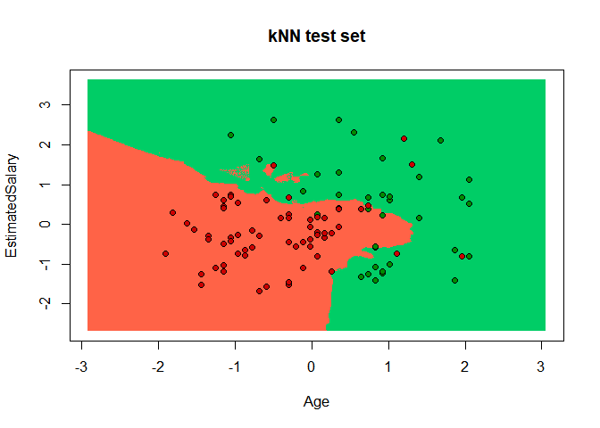
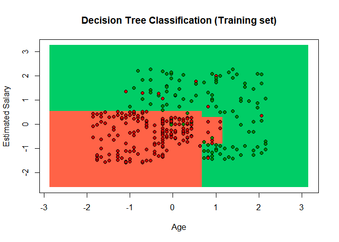

Logistic Regression -------------------------------------------------------------------------

```r
# Import dataset
dataset=read.csv('Social_Network_Ads.csv')
head(dataset)
```

```
##    User.ID Gender Age EstimatedSalary Purchased
## 1 15624510   Male  19           19000         0
## 2 15810944   Male  35           20000         0
## 3 15668575 Female  26           43000         0
## 4 15603246 Female  27           57000         0
## 5 15804002   Male  19           76000         0
## 6 15728773   Male  27           58000         0
```

```r
# we only need age and salary for predicting purchased in this problem, so limit the dataset
dataset=dataset[,3:5]
head(dataset)
```

```
##   Age EstimatedSalary Purchased
## 1  19           19000         0
## 2  35           20000         0
## 3  26           43000         0
## 4  27           57000         0
## 5  19           76000         0
## 6  27           58000         0
```

```r
# Split the dataset into training and test set
library(caTools)
set.seed(123)
Split=sample.split(dataset$Purchased,SplitRatio = 0.75)
training_set=subset(dataset,Split==TRUE)
test_set=subset(dataset,Split==FALSE)

#Feature Scaling
training_set[,1:2]=scale(training_set[,1:2])
test_set[,1:2]=scale(test_set[,1:2])

# Fit logistic regression to the dataset
classifier=glm(formula=Purchased~.,
               family=binomial,
               data=training_set)
summary(classifier)
```

```
## 
## Call:
## glm(formula = Purchased ~ ., family = binomial, data = training_set)
## 
## Deviance Residuals: 
##     Min       1Q   Median       3Q      Max  
## -3.0753  -0.5235  -0.1161   0.3224   2.3977  
## 
## Coefficients:
##                 Estimate Std. Error z value Pr(>|z|)    
## (Intercept)      -1.1923     0.2018  -5.908 3.47e-09 ***
## Age               2.6324     0.3461   7.606 2.83e-14 ***
## EstimatedSalary   1.3947     0.2326   5.996 2.03e-09 ***
## ---
## Signif. codes:  0 '***' 0.001 '**' 0.01 '*' 0.05 '.' 0.1 ' ' 1
## 
## (Dispersion parameter for binomial family taken to be 1)
## 
##     Null deviance: 390.89  on 299  degrees of freedom
## Residual deviance: 199.78  on 297  degrees of freedom
## AIC: 205.78
## 
## Number of Fisher Scoring iterations: 6
```

```r
# Predict the test set result
# In the data you'll pass all the columns of test set except the dependent variable itself,so, -3
prob_pred=predict(classifier,type='response',newdata=test_set[,-3])
y_pred=ifelse(prob_pred>0.5,1,0)


# making the confusion matrix
cm=table(test_set[,3],y_pred)
cm
```

```
##    y_pred
##      0  1
##   0 57  7
##   1 10 26
```

```r
# Visualizing the training set results
#install.packages('ElemStatLearn')
library(ElemStatLearn)
set = training_set
X1 = seq(min(set[, 1]) - 1, max(set[, 1]) + 1, by = 0.01)
X2 = seq(min(set[, 2]) - 1, max(set[, 2]) + 1, by = 0.01)
grid_set = expand.grid(X1, X2)
colnames(grid_set) = c('Age', 'EstimatedSalary')
prob_set = predict(classifier, type = 'response', newdata = grid_set)
y_grid = ifelse(prob_set > 0.5, 1, 0)
plot(set[, -3],
     main = 'Logistic Regression (Training set)',
     xlab = 'Age', ylab = 'Estimated Salary',
     xlim = range(X1), ylim = range(X2))
contour(X1, X2, matrix(as.numeric(y_grid), length(X1), length(X2)), add = TRUE)
points(grid_set, pch = '.', col = ifelse(y_grid == 1, 'springgreen3', 'tomato'))
points(set, pch = 21, bg = ifelse(set[, 3] == 1, 'green4', 'red3'))
```

<!-- -->

```r
# Visualising the Test set results
library(ElemStatLearn)
set = test_set
X1 = seq(min(set[, 1]) - 1, max(set[, 1]) + 1, by = 0.01)
X2 = seq(min(set[, 2]) - 1, max(set[, 2]) + 1, by = 0.01)
grid_set = expand.grid(X1, X2)
colnames(grid_set) = c('Age', 'EstimatedSalary')
prob_set = predict(classifier, type = 'response', newdata = grid_set)
y_grid = ifelse(prob_set > 0.5, 1, 0)
plot(set[, -3],
     main = 'Logistic Regression (Test set)',
     xlab = 'Age', ylab = 'Estimated Salary',
     xlim = range(X1), ylim = range(X2))
contour(X1, X2, matrix(as.numeric(y_grid), length(X1), length(X2)), add = TRUE)
points(grid_set, pch = '.', col = ifelse(y_grid == 1, 'springgreen3', 'tomato'))
points(set, pch = 21, bg = ifelse(set[, 3] == 1, 'green4', 'red3'))
```

<!-- -->

kNN Classification---------------------------------------------------------------------------------


```r
# Import the dataset
dataset=read.csv('Social_Network_Ads.csv')
head(dataset)
```

```
##    User.ID Gender Age EstimatedSalary Purchased
## 1 15624510   Male  19           19000         0
## 2 15810944   Male  35           20000         0
## 3 15668575 Female  26           43000         0
## 4 15603246 Female  27           57000         0
## 5 15804002   Male  19           76000         0
## 6 15728773   Male  27           58000         0
```

```r
str(dataset)
```

```
## 'data.frame':	400 obs. of  5 variables:
##  $ User.ID        : int  15624510 15810944 15668575 15603246 15804002 15728773 15598044 15694829 15600575 15727311 ...
##  $ Gender         : Factor w/ 2 levels "Female","Male": 2 2 1 1 2 2 1 1 2 1 ...
##  $ Age            : int  19 35 26 27 19 27 27 32 25 35 ...
##  $ EstimatedSalary: int  19000 20000 43000 57000 76000 58000 84000 150000 33000 65000 ...
##  $ Purchased      : int  0 0 0 0 0 0 0 1 0 0 ...
```

```r
dataset=dataset[,3:5]

str(dataset)
```

```
## 'data.frame':	400 obs. of  3 variables:
##  $ Age            : int  19 35 26 27 19 27 27 32 25 35 ...
##  $ EstimatedSalary: int  19000 20000 43000 57000 76000 58000 84000 150000 33000 65000 ...
##  $ Purchased      : int  0 0 0 0 0 0 0 1 0 0 ...
```

```r
# Convert Purchased(dependent variable) into factor type
dataset$Purchased=factor(dataset$Purchased,levels = c(0,1))
#dataset[,3]=factor(dataset[,3],levels = c(0,1))
str(dataset)
```

```
## 'data.frame':	400 obs. of  3 variables:
##  $ Age            : int  19 35 26 27 19 27 27 32 25 35 ...
##  $ EstimatedSalary: int  19000 20000 43000 57000 76000 58000 84000 150000 33000 65000 ...
##  $ Purchased      : Factor w/ 2 levels "0","1": 1 1 1 1 1 1 1 2 1 1 ...
```

```r
summary(dataset)
```

```
##       Age        EstimatedSalary  Purchased
##  Min.   :18.00   Min.   : 15000   0:257    
##  1st Qu.:29.75   1st Qu.: 43000   1:143    
##  Median :37.00   Median : 70000            
##  Mean   :37.66   Mean   : 69743            
##  3rd Qu.:46.00   3rd Qu.: 88000            
##  Max.   :60.00   Max.   :150000
```

```r
# Split data into training and testing
library(caTools)
set.seed(123)
Split=sample.split(dataset$Purchased,SplitRatio = 0.75)
training_set=subset(dataset,Split==TRUE)
test_set=subset(dataset,Split==FALSE)

# Scale the dataset
training_set[,-3]=scale(training_set[,-3])
test_set[,-3]=scale(test_set[,-3])

#Fit the kNN model- lazy learning and predict the output for test dataset
library(class)
y_pred=knn(train=training_set[,-3],test=test_set[,-3],cl=training_set[,3], k=5)

# Make the confusion matrix
cm=table(test_set[,3],y_pred)
cm
```

```
##    y_pred
##      0  1
##   0 59  5
##   1  6 30
```

```r
# Visualizing the training set results
library(ElemStatLearn)
set=training_set
X1=seq(min(set[,1])-1,max(set[,1])+1,by=0.01)
X2=seq(min(set[,2])-1,max(set[,2])+1,by=0.01)
grid_set=expand.grid(X1,X2)
colnames(grid_set)=c('Age','EstimatedSalary')
y_grid=knn(train=set[,-3],test=grid_set,cl=set[,3],k=5)
plot(set[,-3],xlab='Age',ylab='EstimatedSalary',main='kNN training set',xlim=range(X1),ylim=range(X2))
contour(X1,X2,matrix(as.numeric(y_grid),length(X1),length(X2)),add=TRUE)
points(grid_set,pch='.',col=ifelse(y_grid==1,'springgreen3','tomato'))
points(set,pch=21,bg=ifelse(set[,3]==1,'green4','red3'))
```

<!-- -->

```r
# Visualizing the test set results
library(ElemStatLearn)
set=test_set
X1=seq(min(set[,1])-1,max(set[,1])+1,by=0.01)
X2=seq(min(set[,2])-1,max(set[,2])+1,by=0.01)
grid_set=expand.grid(X1,X2)
colnames(grid_set)=c('Age','EstimatedSalary')
y_grid=knn(train=training_set[,-3],test=grid_set,cl=training_set[,3],k=5)
plot(training_set[,-3],xlab='Age',ylab='EstimatedSalary',main='kNN test set',xlim=range(X1),ylim=range(X2))
contour(X1,X2,matrix(as.numeric(y_grid),length(X1),length(X2)),add=TRUE)
points(grid_set,pch='.',col=ifelse(y_grid==1,'springgreen3','tomato'))
points(set,pch=21,bg=ifelse(set[,3]==1,'green4','red3'))
```

<!-- -->

SVM Classification---------------------------------------------------------------------------------------


```r
#SVM Classification----------------------------------------------------------------------------------------
# Import dataset
dataset=read.csv('Social_Network_Ads.csv')
head(dataset)
```

```
##    User.ID Gender Age EstimatedSalary Purchased
## 1 15624510   Male  19           19000         0
## 2 15810944   Male  35           20000         0
## 3 15668575 Female  26           43000         0
## 4 15603246 Female  27           57000         0
## 5 15804002   Male  19           76000         0
## 6 15728773   Male  27           58000         0
```

```r
# we only need age and salary for predicting purchased in this problem, so limit the dataset
dataset=dataset[,3:5]
head(dataset)
```

```
##   Age EstimatedSalary Purchased
## 1  19           19000         0
## 2  35           20000         0
## 3  26           43000         0
## 4  27           57000         0
## 5  19           76000         0
## 6  27           58000         0
```

```r
# Split the dataset into training and test set
library(caTools)
set.seed(123)
Split=sample.split(dataset$Purchased,SplitRatio = 0.75)
training_set=subset(dataset,Split==TRUE)
test_set=subset(dataset,Split==FALSE)

#Feature Scaling
training_set[,1:2]=scale(training_set[,1:2])
test_set[,1:2]=scale(test_set[,1:2])

# Fit SVM classifier to the dataset
library(e1071)
svm_classifier=svm(formula=Purchased~.,
               data=training_set,type='C-classification',kernel='linear')
summary(svm_classifier)
```

```
## 
## Call:
## svm(formula = Purchased ~ ., data = training_set, type = "C-classification", 
##     kernel = "linear")
## 
## 
## Parameters:
##    SVM-Type:  C-classification 
##  SVM-Kernel:  linear 
##        cost:  1 
##       gamma:  0.5 
## 
## Number of Support Vectors:  116
## 
##  ( 58 58 )
## 
## 
## Number of Classes:  2 
## 
## Levels: 
##  0 1
```

```r
# Predict the test set result
y_pred=predict(svm_classifier,newdata=test_set[,-3])


# making the confusion matrix
cm=table(test_set[,3],y_pred)
cm
```

```
##    y_pred
##      0  1
##   0 57  7
##   1 13 23
```

```r
# Visualizing the training set results
#install.packages('ElemStatLearn')
library(ElemStatLearn)
set = training_set
X1 = seq(min(set[, 1]) - 1, max(set[, 1]) + 1, by = 0.01)
X2 = seq(min(set[, 2]) - 1, max(set[, 2]) + 1, by = 0.01)
grid_set = expand.grid(X1, X2)
colnames(grid_set) = c('Age', 'EstimatedSalary')
y_grid = predict(svm_classifier, newdata = grid_set)
plot(set[, -3],
     main = 'SVM Linear Classification (Training set)',
     xlab = 'Age', ylab = 'Estimated Salary',
     xlim = range(X1), ylim = range(X2))
contour(X1, X2, matrix(as.numeric(y_grid), length(X1), length(X2)), add = TRUE)
points(grid_set, pch = '.', col = ifelse(y_grid == 1, 'springgreen3', 'tomato'))
points(set, pch = 21, bg = ifelse(set[, 3] == 1, 'green4', 'red3'))
```

<!-- -->

```r
# Visualising the Test set results
library(ElemStatLearn)
set = test_set
X1 = seq(min(set[, 1]) - 1, max(set[, 1]) + 1, by = 0.01)
X2 = seq(min(set[, 2]) - 1, max(set[, 2]) + 1, by = 0.01)
grid_set = expand.grid(X1, X2)
colnames(grid_set) = c('Age', 'EstimatedSalary')
y_grid = predict(svm_classifier, newdata = grid_set)
plot(set[, -3],
     main = 'SVM Linear Classification (Test set)',
     xlab = 'Age', ylab = 'Estimated Salary',
     xlim = range(X1), ylim = range(X2))
contour(X1, X2, matrix(as.numeric(y_grid), length(X1), length(X2)), add = TRUE)
points(grid_set, pch = '.', col = ifelse(y_grid == 1, 'springgreen3', 'tomato'))
points(set, pch = 21, bg = ifelse(set[, 3] == 1, 'green4', 'red3'))
```

<!-- -->
Kernel SVM-------------------------------------------------------------------------------------------------


```r
#Kernel SVM Classification----------------------------------------------------------------------------------------
# Import dataset
dataset=read.csv('Social_Network_Ads.csv')
head(dataset)
```

```
##    User.ID Gender Age EstimatedSalary Purchased
## 1 15624510   Male  19           19000         0
## 2 15810944   Male  35           20000         0
## 3 15668575 Female  26           43000         0
## 4 15603246 Female  27           57000         0
## 5 15804002   Male  19           76000         0
## 6 15728773   Male  27           58000         0
```

```r
# we only need age and salary for predicting purchased in this problem, so limit the dataset
dataset=dataset[,3:5]
head(dataset)
```

```
##   Age EstimatedSalary Purchased
## 1  19           19000         0
## 2  35           20000         0
## 3  26           43000         0
## 4  27           57000         0
## 5  19           76000         0
## 6  27           58000         0
```

```r
# Split the dataset into training and test set
library(caTools)
set.seed(123)
Split=sample.split(dataset$Purchased,SplitRatio = 0.75)
training_set=subset(dataset,Split==TRUE)
test_set=subset(dataset,Split==FALSE)

#Feature Scaling
training_set[,1:2]=scale(training_set[,1:2])
test_set[,1:2]=scale(test_set[,1:2])

# Fit SVM classifier to the dataset
library(e1071)
# Here radial basis means gaussian
ksvm_classifier=svm(formula=Purchased~.,
               data=training_set,type='C-classification',kernel='radial')
summary(ksvm_classifier)
```

```
## 
## Call:
## svm(formula = Purchased ~ ., data = training_set, type = "C-classification", 
##     kernel = "radial")
## 
## 
## Parameters:
##    SVM-Type:  C-classification 
##  SVM-Kernel:  radial 
##        cost:  1 
##       gamma:  0.5 
## 
## Number of Support Vectors:  77
## 
##  ( 39 38 )
## 
## 
## Number of Classes:  2 
## 
## Levels: 
##  0 1
```

```r
# Predict the test set result
y_pred=predict(ksvm_classifier,newdata=test_set[,-3])


# making the confusion matrix
cm=table(test_set[,3],y_pred)
cm
```

```
##    y_pred
##      0  1
##   0 58  6
##   1  4 32
```

```r
# Visualizing the training set results
#install.packages('ElemStatLearn')
library(ElemStatLearn)
set = training_set
X1 = seq(min(set[, 1]) - 1, max(set[, 1]) + 1, by = 0.01)
X2 = seq(min(set[, 2]) - 1, max(set[, 2]) + 1, by = 0.01)
grid_set = expand.grid(X1, X2)
colnames(grid_set) = c('Age', 'EstimatedSalary')
y_grid = predict(ksvm_classifier, newdata = grid_set)
plot(set[, -3],
     main = 'Kernel SVM Classification (Training set)',
     xlab = 'Age', ylab = 'Estimated Salary',
     xlim = range(X1), ylim = range(X2))
contour(X1, X2, matrix(as.numeric(y_grid), length(X1), length(X2)), add = TRUE)
points(grid_set, pch = '.', col = ifelse(y_grid == 1, 'springgreen3', 'tomato'))
points(set, pch = 21, bg = ifelse(set[, 3] == 1, 'green4', 'red3'))
```

<!-- -->

```r
# Visualising the Test set results
library(ElemStatLearn)
set = test_set
X1 = seq(min(set[, 1]) - 1, max(set[, 1]) + 1, by = 0.01)
X2 = seq(min(set[, 2]) - 1, max(set[, 2]) + 1, by = 0.01)
grid_set = expand.grid(X1, X2)
colnames(grid_set) = c('Age', 'EstimatedSalary')
y_grid = predict(ksvm_classifier, newdata = grid_set)
plot(set[, -3],
     main = 'Kernel SVM Classification (Test set)',
     xlab = 'Age', ylab = 'Estimated Salary',
     xlim = range(X1), ylim = range(X2))
contour(X1, X2, matrix(as.numeric(y_grid), length(X1), length(X2)), add = TRUE)
points(grid_set, pch = '.', col = ifelse(y_grid == 1, 'springgreen3', 'tomato'))
points(set, pch = 21, bg = ifelse(set[, 3] == 1, 'green4', 'red3'))
```

<!-- -->
Naive Bayes------------------------------------------------------------------------------------------

```r
# Naive Bayes-----------------------------------------
# Import dataset
dataset=read.csv('Social_Network_Ads.csv')
head(dataset)
```

```
##    User.ID Gender Age EstimatedSalary Purchased
## 1 15624510   Male  19           19000         0
## 2 15810944   Male  35           20000         0
## 3 15668575 Female  26           43000         0
## 4 15603246 Female  27           57000         0
## 5 15804002   Male  19           76000         0
## 6 15728773   Male  27           58000         0
```

```r
# we only need age and salary for predicting purchased in this problem, so limit the dataset
dataset=dataset[,3:5]
head(dataset)
```

```
##   Age EstimatedSalary Purchased
## 1  19           19000         0
## 2  35           20000         0
## 3  26           43000         0
## 4  27           57000         0
## 5  19           76000         0
## 6  27           58000         0
```

```r
# Convert dependent variable into factor typr
dataset$Purchased=factor(dataset$Purchased,levels=c(0,1))

# Split the dataset into training and test set
library(caTools)
set.seed(123)
Split=sample.split(dataset$Purchased,SplitRatio = 0.75)
training_set=subset(dataset,Split==TRUE)
test_set=subset(dataset,Split==FALSE)

#Feature Scaling
training_set[,1:2]=scale(training_set[,1:2])
test_set[,1:2]=scale(test_set[,1:2])

# Fit Naive Bayes model to the dataset
library(e1071)
#NB_classifier=naiveBayes(formula=Purchased~.,data=training_set)
NB_classifier=naiveBayes(x=training_set[,-3],y=training_set[,3])

summary(NB_classifier)
```

```
##         Length Class  Mode     
## apriori 2      table  numeric  
## tables  2      -none- list     
## levels  2      -none- character
## call    3      -none- call
```

```r
# Predict the test set result
y_pred=predict(NB_classifier,newdata=test_set[,-3])
y_pred
```

```
##   [1] 0 0 0 0 0 0 0 1 0 0 1 0 0 0 0 0 0 0 0 0 1 0 0 0 0 1 0 0 0 1 0 0 0 0 0
##  [36] 0 0 0 0 0 0 0 0 0 0 0 0 0 0 0 0 0 1 1 1 0 1 0 0 1 1 0 1 1 1 0 1 1 1 1
##  [71] 1 0 1 1 1 0 1 0 0 1 0 1 0 1 0 1 1 0 0 1 1 0 1 0 1 1 1 1 0 1
## Levels: 0 1
```

```r
# making the confusion matrix
cm=table(test_set[,3],y_pred)
cm
```

```
##    y_pred
##      0  1
##   0 57  7
##   1  7 29
```

```r
# Visualizing the training set results
#install.packages('ElemStatLearn')
library(ElemStatLearn)
set = training_set
X1 = seq(min(set[, 1]) - 1, max(set[, 1]) + 1, by = 0.01)
X2 = seq(min(set[, 2]) - 1, max(set[, 2]) + 1, by = 0.01)
grid_set = expand.grid(X1, X2)
colnames(grid_set) = c('Age', 'EstimatedSalary')
y_grid = predict(NB_classifier, newdata = grid_set)
plot(set[, -3],
     main = 'Naive Bayes Classification (Training set)',
     xlab = 'Age', ylab = 'Estimated Salary',
     xlim = range(X1), ylim = range(X2))
contour(X1, X2, matrix(as.numeric(y_grid), length(X1), length(X2)), add = TRUE)
points(grid_set, pch = '.', col = ifelse(y_grid == 1, 'springgreen3', 'tomato'))
points(set, pch = 21, bg = ifelse(set[, 3] == 1, 'green4', 'red3'))
```

<!-- -->

```r
# Visualising the Test set results
library(ElemStatLearn)
set = test_set
X1 = seq(min(set[, 1]) - 1, max(set[, 1]) + 1, by = 0.01)
X2 = seq(min(set[, 2]) - 1, max(set[, 2]) + 1, by = 0.01)
grid_set = expand.grid(X1, X2)
colnames(grid_set) = c('Age', 'EstimatedSalary')
y_grid = predict(NB_classifier, newdata = grid_set)
plot(set[, -3],
     main = 'Naive Bayes Classification (Test set)',
     xlab = 'Age', ylab = 'Estimated Salary',
     xlim = range(X1), ylim = range(X2))
contour(X1, X2, matrix(as.numeric(y_grid), length(X1), length(X2)), add = TRUE)
points(grid_set, pch = '.', col = ifelse(y_grid == 1, 'springgreen3', 'tomato'))
points(set, pch = 21, bg = ifelse(set[, 3] == 1, 'green4', 'red3'))
```

<!-- -->
Decision Tree Classifier---------------------------------------------------------------------------------


```r
# Decision Tree -----------------------------------------
# Import dataset
dataset=read.csv('Social_Network_Ads.csv')
head(dataset)
```

```
##    User.ID Gender Age EstimatedSalary Purchased
## 1 15624510   Male  19           19000         0
## 2 15810944   Male  35           20000         0
## 3 15668575 Female  26           43000         0
## 4 15603246 Female  27           57000         0
## 5 15804002   Male  19           76000         0
## 6 15728773   Male  27           58000         0
```

```r
# we only need age and salary for predicting purchased in this problem, so limit the dataset
dataset=dataset[,3:5]
head(dataset)
```

```
##   Age EstimatedSalary Purchased
## 1  19           19000         0
## 2  35           20000         0
## 3  26           43000         0
## 4  27           57000         0
## 5  19           76000         0
## 6  27           58000         0
```

```r
# Convert dependent variable into factor typr
dataset$Purchased=factor(dataset$Purchased,levels=c(0,1))

# Split the dataset into training and test set
library(caTools)
set.seed(123)
Split=sample.split(dataset$Purchased,SplitRatio = 0.75)
training_set=subset(dataset,Split==TRUE)
test_set=subset(dataset,Split==FALSE)

#Feature Scaling- not required for Decision trees
training_set[,1:2]=scale(training_set[,1:2])
test_set[,1:2]=scale(test_set[,1:2])

# Fit Decision tree to the dataset
library(rpart)
Tree_classifier=rpart(formula=Purchased~.,data=training_set)

summary(Tree_classifier)
```

```
## Call:
## rpart(formula = Purchased ~ ., data = training_set)
##   n= 300 
## 
##           CP nsplit rel error    xerror       xstd
## 1 0.55140187      0 1.0000000 1.0000000 0.07754006
## 2 0.23364486      1 0.4485981 0.4672897 0.06032684
## 3 0.01246106      2 0.2149533 0.2336449 0.04473958
## 4 0.01000000      5 0.1775701 0.2523364 0.04632536
## 
## Variable importance
##             Age EstimatedSalary 
##              56              44 
## 
## Node number 1: 300 observations,    complexity param=0.5514019
##   predicted class=0  expected loss=0.3566667  P(node) =1
##     class counts:   193   107
##    probabilities: 0.643 0.357 
##   left son=2 (221 obs) right son=3 (79 obs)
##   Primary splits:
##       Age             < 0.6724378  to the left,  improve=57.27285, (0 missing)
##       EstimatedSalary < 0.5387442  to the left,  improve=47.14670, (0 missing)
##   Surrogate splits:
##       EstimatedSalary < 1.908675   to the left,  agree=0.747, adj=0.038, (0 split)
## 
## Node number 2: 221 observations,    complexity param=0.2336449
##   predicted class=0  expected loss=0.1719457  P(node) =0.7366667
##     class counts:   183    38
##    probabilities: 0.828 0.172 
##   left son=4 (182 obs) right son=5 (39 obs)
##   Primary splits:
##       EstimatedSalary < 0.5530144  to the left,  improve=39.840550, (0 missing)
##       Age             < -0.5704567 to the left,  improve= 4.113636, (0 missing)
##   Surrogate splits:
##       Age < 0.4812232  to the left,  agree=0.833, adj=0.051, (0 split)
## 
## Node number 3: 79 observations,    complexity param=0.01246106
##   predicted class=1  expected loss=0.1265823  P(node) =0.2633333
##     class counts:    10    69
##    probabilities: 0.127 0.873 
##   left son=6 (39 obs) right son=7 (40 obs)
##   Primary splits:
##       Age             < 1.150474   to the left,  improve=1.6722010, (0 missing)
##       EstimatedSalary < -0.8026462 to the right, improve=0.9078706, (0 missing)
##   Surrogate splits:
##       EstimatedSalary < -0.3174624 to the left,  agree=0.595, adj=0.179, (0 split)
## 
## Node number 4: 182 observations
##   predicted class=0  expected loss=0.03296703  P(node) =0.6066667
##     class counts:   176     6
##    probabilities: 0.967 0.033 
## 
## Node number 5: 39 observations
##   predicted class=1  expected loss=0.1794872  P(node) =0.13
##     class counts:     7    32
##    probabilities: 0.179 0.821 
## 
## Node number 6: 39 observations,    complexity param=0.01246106
##   predicted class=1  expected loss=0.2307692  P(node) =0.13
##     class counts:     9    30
##    probabilities: 0.231 0.769 
##   left son=12 (22 obs) right son=13 (17 obs)
##   Primary splits:
##       EstimatedSalary < -0.8169163 to the right, improve=1.7819830, (0 missing)
##       Age             < 0.8636523  to the left,  improve=0.2307692, (0 missing)
##   Surrogate splits:
##       Age < 0.768045   to the right, agree=0.59, adj=0.059, (0 split)
## 
## Node number 7: 40 observations
##   predicted class=1  expected loss=0.025  P(node) =0.1333333
##     class counts:     1    39
##    probabilities: 0.025 0.975 
## 
## Node number 12: 22 observations,    complexity param=0.01246106
##   predicted class=1  expected loss=0.3636364  P(node) =0.07333333
##     class counts:     8    14
##    probabilities: 0.364 0.636 
##   left son=24 (8 obs) right son=25 (14 obs)
##   Primary splits:
##       EstimatedSalary < 0.2961524  to the left,  improve=3.75324700, (0 missing)
##       Age             < 0.9592596  to the left,  improve=0.02797203, (0 missing)
## 
## Node number 13: 17 observations
##   predicted class=1  expected loss=0.05882353  P(node) =0.05666667
##     class counts:     1    16
##    probabilities: 0.059 0.941 
## 
## Node number 24: 8 observations
##   predicted class=0  expected loss=0.25  P(node) =0.02666667
##     class counts:     6     2
##    probabilities: 0.750 0.250 
## 
## Node number 25: 14 observations
##   predicted class=1  expected loss=0.1428571  P(node) =0.04666667
##     class counts:     2    12
##    probabilities: 0.143 0.857
```

```r
# Predict the test set result
y_pred=predict(Tree_classifier,newdata=test_set[,-3],type='class')
y_pred
```

```
##   2   4   5   9  12  18  19  20  22  29  32  34  35  38  45  46  48  52 
##   0   0   0   0   0   0   1   1   0   0   1   0   1   0   0   0   0   0 
##  66  69  74  75  82  84  85  86  87  89 103 104 107 108 109 117 124 126 
##   0   0   1   0   0   1   0   1   0   0   1   1   0   1   1   0   0   0 
## 127 131 134 139 148 154 156 159 162 163 170 175 176 193 199 200 208 213 
##   0   0   0   0   0   0   0   0   1   0   0   0   0   0   0   0   1   1 
## 224 226 228 229 230 234 236 237 239 241 255 264 265 266 273 274 281 286 
##   1   0   1   0   0   1   1   0   1   1   0   0   1   1   1   1   1   1 
## 292 299 302 305 307 310 316 324 326 332 339 341 343 347 353 363 364 367 
##   1   0   0   0   1   0   0   1   0   1   0   1   0   1   1   0   0   1 
## 368 369 372 373 380 383 389 392 395 400 
##   1   0   1   0   1   1   1   1   0   1 
## Levels: 0 1
```

```r
# making the confusion matrix
cm=table(test_set[,3],y_pred)
cm
```

```
##    y_pred
##      0  1
##   0 53 11
##   1  6 30
```

```r
# Visualizing the training set results
#install.packages('ElemStatLearn')
library(ElemStatLearn)
set = training_set
X1 = seq(min(set[, 1]) - 1, max(set[, 1]) + 1, by = 0.01)
X2 = seq(min(set[, 2]) - 1, max(set[, 2]) + 1, by = 0.01)
grid_set = expand.grid(X1, X2)
colnames(grid_set) = c('Age', 'EstimatedSalary')
y_grid = predict(Tree_classifier, newdata = grid_set,type='class')
plot(set[, -3],
     main = 'Decision Tree Classification (Training set)',
     xlab = 'Age', ylab = 'Estimated Salary',
     xlim = range(X1), ylim = range(X2))
contour(X1, X2, matrix(as.numeric(y_grid), length(X1), length(X2)), add = TRUE)
points(grid_set, pch = '.', col = ifelse(y_grid == 1, 'springgreen3', 'tomato'))
points(set, pch = 21, bg = ifelse(set[, 3] == 1, 'green4', 'red3'))
```

<!-- -->

```r
# Visualising the Test set results
library(ElemStatLearn)
set = test_set
X1 = seq(min(set[, 1]) - 1, max(set[, 1]) + 1, by = 0.01)
X2 = seq(min(set[, 2]) - 1, max(set[, 2]) + 1, by = 0.01)
grid_set = expand.grid(X1, X2)
colnames(grid_set) = c('Age', 'EstimatedSalary')
y_grid = predict(Tree_classifier, newdata = grid_set,type='class')
plot(set[, -3],
     main = 'Decision Tree Classification (Test set)',
     xlab = 'Age', ylab = 'Estimated Salary',
     xlim = range(X1), ylim = range(X2))
contour(X1, X2, matrix(as.numeric(y_grid), length(X1), length(X2)), add = TRUE)
points(grid_set, pch = '.', col = ifelse(y_grid == 1, 'springgreen3', 'tomato'))
points(set, pch = 21, bg = ifelse(set[, 3] == 1, 'green4', 'red3'))
```

<!-- -->

```r
# Plot the trees
plot(Tree_classifier)
text(Tree_classifier)
```

<!-- -->

Random Forest Classification--------------------------------------------------------------------------


```r
# Random Forest -----------------------------------------
# Import dataset
dataset=read.csv('Social_Network_Ads.csv')
head(dataset)
```

```
##    User.ID Gender Age EstimatedSalary Purchased
## 1 15624510   Male  19           19000         0
## 2 15810944   Male  35           20000         0
## 3 15668575 Female  26           43000         0
## 4 15603246 Female  27           57000         0
## 5 15804002   Male  19           76000         0
## 6 15728773   Male  27           58000         0
```

```r
# we only need age and salary for predicting purchased in this problem, so limit the dataset
dataset=dataset[,3:5]
head(dataset)
```

```
##   Age EstimatedSalary Purchased
## 1  19           19000         0
## 2  35           20000         0
## 3  26           43000         0
## 4  27           57000         0
## 5  19           76000         0
## 6  27           58000         0
```

```r
# Convert dependent variable into factor typr
dataset$Purchased=factor(dataset$Purchased,levels=c(0,1))

# Split the dataset into training and test set
library(caTools)
set.seed(123)
Split=sample.split(dataset$Purchased,SplitRatio = 0.75)
training_set=subset(dataset,Split==TRUE)
test_set=subset(dataset,Split==FALSE)

#Feature Scaling
training_set[,1:2]=scale(training_set[,1:2])
test_set[,1:2]=scale(test_set[,1:2])

# Fit model to the dataset
#install.packages('randomForest')
library(randomForest)
```

```
## randomForest 4.6-14
```

```
## Type rfNews() to see new features/changes/bug fixes.
```

```r
RF_classifier=randomForest(x=training_set[,-3],y=training_set[,3],ntree=10)

summary(RF_classifier)
```

```
##                 Length Class  Mode     
## call              4    -none- call     
## type              1    -none- character
## predicted       300    factor numeric  
## err.rate         30    -none- numeric  
## confusion         6    -none- numeric  
## votes           600    matrix numeric  
## oob.times       300    -none- numeric  
## classes           2    -none- character
## importance        2    -none- numeric  
## importanceSD      0    -none- NULL     
## localImportance   0    -none- NULL     
## proximity         0    -none- NULL     
## ntree             1    -none- numeric  
## mtry              1    -none- numeric  
## forest           14    -none- list     
## y               300    factor numeric  
## test              0    -none- NULL     
## inbag             0    -none- NULL
```

```r
# Predict the test set result
y_pred=predict(RF_classifier,newdata=test_set[,-3])
y_pred
```

```
##   2   4   5   9  12  18  19  20  22  29  32  34  35  38  45  46  48  52 
##   0   0   0   0   0   0   1   1   0   0   0   0   0   0   0   0   0   0 
##  66  69  74  75  82  84  85  86  87  89 103 104 107 108 109 117 124 126 
##   0   0   1   0   0   1   0   1   0   0   0   1   0   0   0   0   0   0 
## 127 131 134 139 148 154 156 159 162 163 170 175 176 193 199 200 208 213 
##   0   0   0   0   0   0   0   0   0   0   0   0   0   0   0   0   1   1 
## 224 226 228 229 230 234 236 237 239 241 255 264 265 266 273 274 281 286 
##   1   0   1   0   0   1   1   0   0   1   0   0   1   1   1   1   1   1 
## 292 299 302 305 307 310 316 324 326 332 339 341 343 347 353 363 364 367 
##   1   0   0   0   1   0   0   1   0   1   0   1   0   1   1   0   0   1 
## 368 369 372 373 380 383 389 392 395 400 
##   0   0   1   0   1   0   1   1   0   1 
## Levels: 0 1
```

```r
# making the confusion matrix
cm=table(test_set[,3],y_pred)
cm
```

```
##    y_pred
##      0  1
##   0 59  5
##   1  9 27
```

```r
# Visualizing the training set results
#install.packages('ElemStatLearn')
library(ElemStatLearn)
set = training_set
X1 = seq(min(set[, 1]) - 1, max(set[, 1]) + 1, by = 0.01)
X2 = seq(min(set[, 2]) - 1, max(set[, 2]) + 1, by = 0.01)
grid_set = expand.grid(X1, X2)
colnames(grid_set) = c('Age', 'EstimatedSalary')
y_grid = predict(RF_classifier, newdata = grid_set)
plot(set[, -3],
     main = 'Random Forest Classification (Training set)',
     xlab = 'Age', ylab = 'Estimated Salary',
     xlim = range(X1), ylim = range(X2))
contour(X1, X2, matrix(as.numeric(y_grid), length(X1), length(X2)), add = TRUE)
points(grid_set, pch = '.', col = ifelse(y_grid == 1, 'springgreen3', 'tomato'))
points(set, pch = 21, bg = ifelse(set[, 3] == 1, 'green4', 'red3'))
```

<!-- -->

```r
# Visualising the Test set results
library(ElemStatLearn)
set = test_set
X1 = seq(min(set[, 1]) - 1, max(set[, 1]) + 1, by = 0.01)
X2 = seq(min(set[, 2]) - 1, max(set[, 2]) + 1, by = 0.01)
grid_set = expand.grid(X1, X2)
colnames(grid_set) = c('Age', 'EstimatedSalary')
y_grid = predict(RF_classifier, newdata = grid_set)
plot(set[, -3],
     main = 'Random Forest Classification (Test set)',
     xlab = 'Age', ylab = 'Estimated Salary',
     xlim = range(X1), ylim = range(X2))
contour(X1, X2, matrix(as.numeric(y_grid), length(X1), length(X2)), add = TRUE)
points(grid_set, pch = '.', col = ifelse(y_grid == 1, 'springgreen3', 'tomato'))
points(set, pch = 21, bg = ifelse(set[, 3] == 1, 'green4', 'red3'))
```

<!-- -->

