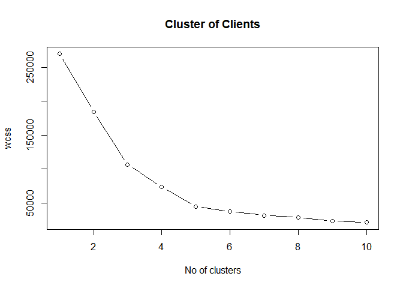
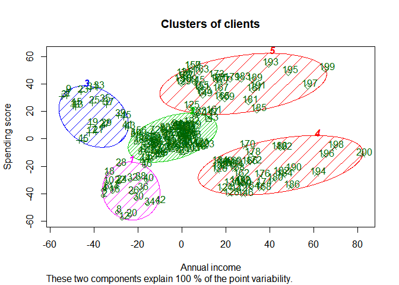
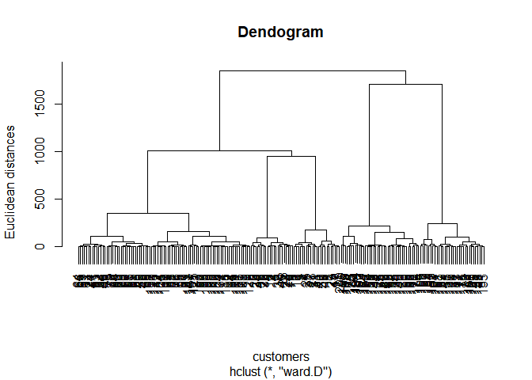
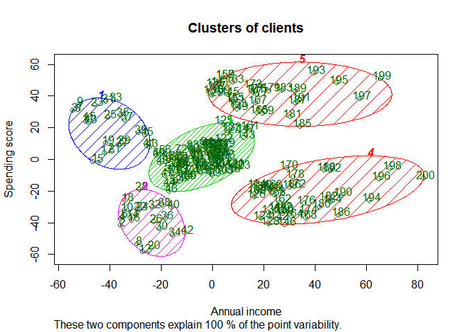

K-means Clustering

```r
# Import the dataset
dataset=read.csv('Mall_Customers.csv')
head(dataset)
```

```
##   CustomerID  Genre Age Annual.Income..k.. Spending.Score..1.100.
## 1          1   Male  19                 15                     39
## 2          2   Male  21                 15                     81
## 3          3 Female  20                 16                      6
## 4          4 Female  23                 16                     77
## 5          5 Female  31                 17                     40
## 6          6 Female  22                 17                     76
```

```r
# limit to only two dimensions for now
X=dataset[,4:5]

# Identify the number of ideal clusters on the basis of elbow method
set.seed(6)
wcss<-vector()
for (i in 1:10)
  wcss[i]<-sum(kmeans(X,i)$withinss)
plot(1:10,wcss, type='b',main=paste('Cluster of Clients'),xlab='No of clusters',ylab='wcss')
```

<!-- -->

```r
# elbow appears at 5

# Form the ideal number of clusters
set.seed(29)
kmeans<-kmeans(X,5,iter.max = 300,nstart=10)

# Visualize the clusters formed
library(cluster)
clusplot(X,
         kmeans$cluster,
         lines=0,
         shade=TRUE,
         color=TRUE,
         labels=2,
         plotchar=2,
         span=TRUE,
         main=paste('Clusters of clients'),
         xlab='Annual income',
         ylab='Spending score'
         )
```

<!-- -->

Heirarchical Clustering


```r
# Import the dataset
dataset=read.csv('Mall_Customers.csv')
head(dataset)
```

```
##   CustomerID  Genre Age Annual.Income..k.. Spending.Score..1.100.
## 1          1   Male  19                 15                     39
## 2          2   Male  21                 15                     81
## 3          3 Female  20                 16                      6
## 4          4 Female  23                 16                     77
## 5          5 Female  31                 17                     40
## 6          6 Female  22                 17                     76
```

```r
# limit to only two dimensions for now
X=dataset[,4:5]

# Form a dendogram to identify ideal number of clusters
dendogram=hclust(dist(X,method='euclidean'),method='ward.D')
plot(dendogram,main=paste('Dendogram'),xlab='customers',ylab='Euclidean distances')
```

<!-- -->

```r
# For the clusters
hc=hclust(dist(X,method='euclidean'),method='ward.D')
y_hc=cutree(hc,5)


# Visualize the clusters
library(cluster)
clusplot(X,
         y_hc,
         lines=0,
         shade=TRUE,
         color=TRUE,
         labels=2,
         plotchar=FALSE,
         span=TRUE,
         main=paste('Clusters of clients'),
         xlab='Annual income',
         ylab='Spending score'
         )
```

<!-- -->

