```r
#integer, need to append L if storing as integer.Otherwise it gets stored as double
x<-2L
typeof(x)
```

```
## [1] "integer"
```

```r
str(x)
```

```
##  int 2
```

```r
xe<-2
typeof(xe)
```

```
## [1] "double"
```

```r
#double
y<-2.5
typeof(y)
```

```
## [1] "double"
```

```r
#complex
z<-3+2i
typeof(z)
```

```
## [1] "complex"
```

```r
#character
a<-"s"
typeof(a)
```

```
## [1] "character"
```

```r
#logical
q <- T
typeof(q)
```

```
## [1] "logical"
```

```r
q1<-TRUE
typeof(q1)
```

```
## [1] "logical"
```

```r
greeting<-"Hello"
name<-"Bob"
message<- paste(greeting,name)
message
```

```
## [1] "Hello Bob"
```

```r
str(message)
```

```
##  chr "Hello Bob"
```

```r
typeof(message)
```

```
## [1] "character"
```

```r
message2=c(greeting,name)
message2
```

```
## [1] "Hello" "Bob"
```

```r
str(message2)
```

```
##  chr [1:2] "Hello" "Bob"
```

```r
typeof(message2)
```

```
## [1] "character"
```

```r
counter<-1
while(counter<12)
{ print(counter)
  counter<-counter+1
  }
```

```
## [1] 1
## [1] 2
## [1] 3
## [1] 4
## [1] 5
## [1] 6
## [1] 7
## [1] 8
## [1] 9
## [1] 10
## [1] 11
```

```r
for (i in 5:10)
{
  print(i)
}
```

```
## [1] 5
## [1] 6
## [1] 7
## [1] 8
## [1] 9
## [1] 10
```

If statements

```r
# rm deletes the previously stored value of answer field
rm(answer)
```

```
## Warning in rm(answer): object 'answer' not found
```

```r
# rnorm is used to generate Random numbers, 1 here denotes we want 1 number generated
# By default rnorm generates number with mean-0 and standard deviation-1. Unless provided otherwise.
x<-rnorm(1)
if(x>1){
  answer<-"Greater than 1"
}else if(x>=-1){
    answer<-"Between -1 and 1"
}else{
      answer<-"Less than -1"}
x
```

```
## [1] -0.04389661
```

```r
answer
```

```
## [1] "Between -1 and 1"
```

```r
counter=0
n=1000
for( i in rnorm(n))
{
    if(i<1 & i>-1){
    counter=counter+1
  }
}
perc=counter/n
counter
```

```
## [1] 678
```

```r
n
```

```
## [1] 1000
```

```r
perc
```

```
## [1] 0.678
```

```r
MyVector <- c(3,45,56,732)
MyVector
```

```
## [1]   3  45  56 732
```

```r
is.numeric(MyVector)
```

```
## [1] TRUE
```

```r
is.integer(MyVector)
```

```
## [1] FALSE
```

```r
is.double(MyVector)
```

```
## [1] TRUE
```

```r
V2<-c(3L,12L,243L,0L)
is.numeric(V2)
```

```
## [1] TRUE
```

```r
is.integer(V2)
```

```
## [1] TRUE
```

```r
is.double(V2)
```

```
## [1] FALSE
```

```r
V3<-c("a","B23","Hello",7)
V3
```

```
## [1] "a"     "B23"   "Hello" "7"
```

```r
is.character(V3)
```

```
## [1] TRUE
```

```r
is.numeric(V3)
```

```
## [1] FALSE
```

```r
seq(1,10)
```

```
##  [1]  1  2  3  4  5  6  7  8  9 10
```

```r
1:10
```

```
##  [1]  1  2  3  4  5  6  7  8  9 10
```

```r
# increment from 1 to 10 in gaps of 2
z<-seq(1,10,2)
z
```

```
## [1] 1 3 5 7 9
```

```r
# Repeat 3 four times
rep(3,4)
```

```
## [1] 3 3 3 3
```

```r
rep("a",5)
```

```
## [1] "a" "a" "a" "a" "a"
```

```r
x<-c(80,20)
y<-rep(x,3)
y
```

```
## [1] 80 20 80 20 80 20
```

```r
x<-c(1,123,534,13,4)    # combine
y<- seq(201,250,11)     # sequence
z<- rep("Hi!",3)        # replicate

w<-c("a","b","c","d","e")
w
```

```
## [1] "a" "b" "c" "d" "e"
```

```r
w[1]
```

```
## [1] "a"
```

```r
w[2]
```

```
## [1] "b"
```

```r
w[3]
```

```
## [1] "c"
```

```r
w[-1]
```

```
## [1] "b" "c" "d" "e"
```

```r
v<-w[-3]
w[1:3]
```

```
## [1] "a" "b" "c"
```

```r
w[3:5]
```

```
## [1] "c" "d" "e"
```

```r
w[c(1,3,5)]
```

```
## [1] "a" "c" "e"
```

```r
w[c(-2,-4)]
```

```
## [1] "a" "c" "e"
```

```r
w[-3:-5]
```

```
## [1] "a" "b"
```

```r
w[1:2]
```

```
## [1] "a" "b"
```

```r
w[0]
```

```
## character(0)
```

```r
w[7]
```

```
## [1] NA
```

Recycling of vectors in Vecor addition


```r
x1=c(1,2,4,6)
x2=c(3,5,8,12,1,4,3,5)
x3=c(23,3,4,1,5,6,3)

# The x1 will get recycled and added to x2
x1+x2
```

```
## [1]  4  7 12 18  2  6  7 11
```

```r
# Again x1 will be recycled, but due to length not in multiples a warning would be printed
x1+x3
```

```
## Warning in x1 + x3: longer object length is not a multiple of shorter
## object length
```

```
## [1] 24  5  8  7  6  8  7
```

```r
#Data
revenue <- c(14574.49, 7606.46, 8611.41, 9175.41, 8058.65, 8105.44, 11496.28, 9766.09, 10305.32, 14379.96, 10713.97, 15433.50)
expenses <- c(12051.82, 5695.07, 12319.20, 12089.72, 8658.57, 840.20, 3285.73, 5821.12, 6976.93, 16618.61, 10054.37, 3803.96)

#Solution
profit<-revenue-expenses
profit
```

```
##  [1]  2522.67  1911.39 -3707.79 -2914.31  -599.92  7265.24  8210.55
##  [8]  3944.97  3328.39 -2238.65   659.60 11629.54
```

```r
profit_tax<-profit*0.7
profit_tax
```

```
##  [1]  1765.869  1337.973 -2595.453 -2040.017  -419.944  5085.668  5747.385
##  [8]  2761.479  2329.873 -1567.055   461.720  8140.678
```

```r
profit_margin<-profit_tax/revenue
profit_margin
```

```
##  [1]  0.12116163  0.17589956 -0.30139698 -0.22233524 -0.05211096
##  [6]  0.62743886  0.49993433  0.28276199  0.22608449 -0.10897492
## [11]  0.04309514  0.52746804
```

```r
good_months<-profit_tax>mean(profit_tax)
good_months
```

```
##  [1]  TRUE FALSE FALSE FALSE FALSE  TRUE  TRUE  TRUE  TRUE FALSE FALSE
## [12]  TRUE
```

```r
bad_months<-profit_tax<mean(profit_tax)
bad_months
```

```
##  [1] FALSE  TRUE  TRUE  TRUE  TRUE FALSE FALSE FALSE FALSE  TRUE  TRUE
## [12] FALSE
```

```r
best_month<-profit_tax==max(profit_tax)
best_month
```

```
##  [1] FALSE FALSE FALSE FALSE FALSE FALSE FALSE FALSE FALSE FALSE FALSE
## [12]  TRUE
```

```r
worst_month<-profit_tax==min(profit_tax)
worst_month
```

```
##  [1] FALSE FALSE  TRUE FALSE FALSE FALSE FALSE FALSE FALSE FALSE FALSE
## [12] FALSE
```


```r
# code to import basketball data
#Dear Student,
#
#Welcome to the world of Basketball Data!
#I'm sure you will enjoy this section of the R Programming course.
#
#Instructions for this dataset:
# Simply select ALL the lines in this script by pressing 
# CTRL+A on Windows or CMND+A on a Mac and execute them
# Once you have executed the commands the following objects
# will be created:
# Matrices:
# - FieldGoalAttempts
# - FieldGoals
# - Games
# - MinutesPlayed
# - Salary
# Vectors:
# - Players
# - Seasons
#We will go understand these inside the course.
#
#Sincerely,
#Kirill Eremenko
#www.superdatascience.com

#Copyright: These datasets were prepared using publicly available data.
#           However, theses scripts are subject to Copyright Laws. 
#           If you wish to use these R scripts outside of the R Programming Course
#           by Kirill Eremenko, you may do so by referencing www.superdatascience.com in your work.

#Comments:
#Seasons are labeled based on the first year in the season
#E.g. the 2012-2013 season is preseneted as simply 2012

#Notes and Corrections to the data:
#Kevin Durant: 2006 - College Data Used
#Kevin Durant: 2005 - Proxied With 2006 Data
#Derrick Rose: 2012 - Did Not Play
#Derrick Rose: 2007 - College Data Used
#Derrick Rose: 2006 - Proxied With 2007 Data
#Derrick Rose: 2005 - Proxied With 2007 Data

#Seasons
Seasons <- c("2005","2006","2007","2008","2009","2010","2011","2012","2013","2014")

#Players
Players <- c("KobeBryant","JoeJohnson","LeBronJames","CarmeloAnthony","DwightHoward","ChrisBosh","ChrisPaul","KevinDurant","DerrickRose","DwayneWade")

#Salaries
KobeBryant_Salary <- c(15946875,17718750,19490625,21262500,23034375,24806250,25244493,27849149,30453805,23500000)
JoeJohnson_Salary <- c(12000000,12744189,13488377,14232567,14976754,16324500,18038573,19752645,21466718,23180790)
LeBronJames_Salary <- c(4621800,5828090,13041250,14410581,15779912,14500000,16022500,17545000,19067500,20644400)
CarmeloAnthony_Salary <- c(3713640,4694041,13041250,14410581,15779912,17149243,18518574,19450000,22407474,22458000)
DwightHoward_Salary <- c(4493160,4806720,6061274,13758000,15202590,16647180,18091770,19536360,20513178,21436271)
ChrisBosh_Salary <- c(3348000,4235220,12455000,14410581,15779912,14500000,16022500,17545000,19067500,20644400)
ChrisPaul_Salary <- c(3144240,3380160,3615960,4574189,13520500,14940153,16359805,17779458,18668431,20068563)
KevinDurant_Salary <- c(0,0,4171200,4484040,4796880,6053663,15506632,16669630,17832627,18995624)
DerrickRose_Salary <- c(0,0,0,4822800,5184480,5546160,6993708,16402500,17632688,18862875)
DwayneWade_Salary <- c(3031920,3841443,13041250,14410581,15779912,14200000,15691000,17182000,18673000,15000000)
#Matrix
Salary <- rbind(KobeBryant_Salary, JoeJohnson_Salary, LeBronJames_Salary, CarmeloAnthony_Salary, DwightHoward_Salary, ChrisBosh_Salary, ChrisPaul_Salary, KevinDurant_Salary, DerrickRose_Salary, DwayneWade_Salary)
rm(KobeBryant_Salary, JoeJohnson_Salary, CarmeloAnthony_Salary, DwightHoward_Salary, ChrisBosh_Salary, LeBronJames_Salary, ChrisPaul_Salary, DerrickRose_Salary, DwayneWade_Salary, KevinDurant_Salary)
colnames(Salary) <- Seasons
rownames(Salary) <- Players

#Games 
KobeBryant_G <- c(80,77,82,82,73,82,58,78,6,35)
JoeJohnson_G <- c(82,57,82,79,76,72,60,72,79,80)
LeBronJames_G <- c(79,78,75,81,76,79,62,76,77,69)
CarmeloAnthony_G <- c(80,65,77,66,69,77,55,67,77,40)
DwightHoward_G <- c(82,82,82,79,82,78,54,76,71,41)
ChrisBosh_G <- c(70,69,67,77,70,77,57,74,79,44)
ChrisPaul_G <- c(78,64,80,78,45,80,60,70,62,82)
KevinDurant_G <- c(35,35,80,74,82,78,66,81,81,27)
DerrickRose_G <- c(40,40,40,81,78,81,39,0,10,51)
DwayneWade_G <- c(75,51,51,79,77,76,49,69,54,62)
#Matrix
Games <- rbind(KobeBryant_G, JoeJohnson_G, LeBronJames_G, CarmeloAnthony_G, DwightHoward_G, ChrisBosh_G, ChrisPaul_G, KevinDurant_G, DerrickRose_G, DwayneWade_G)
rm(KobeBryant_G, JoeJohnson_G, CarmeloAnthony_G, DwightHoward_G, ChrisBosh_G, LeBronJames_G, ChrisPaul_G, DerrickRose_G, DwayneWade_G, KevinDurant_G)
colnames(Games) <- Seasons
rownames(Games) <- Players

#Minutes Played
KobeBryant_MP <- c(3277,3140,3192,2960,2835,2779,2232,3013,177,1207)
JoeJohnson_MP <- c(3340,2359,3343,3124,2886,2554,2127,2642,2575,2791)
LeBronJames_MP <- c(3361,3190,3027,3054,2966,3063,2326,2877,2902,2493)
CarmeloAnthony_MP <- c(2941,2486,2806,2277,2634,2751,1876,2482,2982,1428)
DwightHoward_MP <- c(3021,3023,3088,2821,2843,2935,2070,2722,2396,1223)
ChrisBosh_MP <- c(2751,2658,2425,2928,2526,2795,2007,2454,2531,1556)
ChrisPaul_MP <- c(2808,2353,3006,3002,1712,2880,2181,2335,2171,2857)
KevinDurant_MP <- c(1255,1255,2768,2885,3239,3038,2546,3119,3122,913)
DerrickRose_MP <- c(1168,1168,1168,3000,2871,3026,1375,0,311,1530)
DwayneWade_MP <- c(2892,1931,1954,3048,2792,2823,1625,2391,1775,1971)
#Matrix
MinutesPlayed <- rbind(KobeBryant_MP, JoeJohnson_MP, LeBronJames_MP, CarmeloAnthony_MP, DwightHoward_MP, ChrisBosh_MP, ChrisPaul_MP, KevinDurant_MP, DerrickRose_MP, DwayneWade_MP)
rm(KobeBryant_MP, JoeJohnson_MP, CarmeloAnthony_MP, DwightHoward_MP, ChrisBosh_MP, LeBronJames_MP, ChrisPaul_MP, DerrickRose_MP, DwayneWade_MP, KevinDurant_MP)
colnames(MinutesPlayed) <- Seasons
rownames(MinutesPlayed) <- Players

#Field Goals
KobeBryant_FG <- c(978,813,775,800,716,740,574,738,31,266)
JoeJohnson_FG <- c(632,536,647,620,635,514,423,445,462,446)
LeBronJames_FG <- c(875,772,794,789,768,758,621,765,767,624)
CarmeloAnthony_FG <- c(756,691,728,535,688,684,441,669,743,358)
DwightHoward_FG <- c(468,526,583,560,510,619,416,470,473,251)
ChrisBosh_FG <- c(549,543,507,615,600,524,393,485,492,343)
ChrisPaul_FG <- c(407,381,630,631,314,430,425,412,406,568)
KevinDurant_FG <- c(306,306,587,661,794,711,643,731,849,238)
DerrickRose_FG <- c(208,208,208,574,672,711,302,0,58,338)
DwayneWade_FG <- c(699,472,439,854,719,692,416,569,415,509)
#Matrix
FieldGoals <- rbind(KobeBryant_FG, JoeJohnson_FG, LeBronJames_FG, CarmeloAnthony_FG, DwightHoward_FG, ChrisBosh_FG, ChrisPaul_FG, KevinDurant_FG, DerrickRose_FG, DwayneWade_FG)
rm(KobeBryant_FG, JoeJohnson_FG, LeBronJames_FG, CarmeloAnthony_FG, DwightHoward_FG, ChrisBosh_FG, ChrisPaul_FG, KevinDurant_FG, DerrickRose_FG, DwayneWade_FG)
colnames(FieldGoals) <- Seasons
rownames(FieldGoals) <- Players

#Field Goal Attempts
KobeBryant_FGA <- c(2173,1757,1690,1712,1569,1639,1336,1595,73,713)
JoeJohnson_FGA <- c(1395,1139,1497,1420,1386,1161,931,1052,1018,1025)
LeBronJames_FGA <- c(1823,1621,1642,1613,1528,1485,1169,1354,1353,1279)
CarmeloAnthony_FGA <- c(1572,1453,1481,1207,1502,1503,1025,1489,1643,806)
DwightHoward_FGA <- c(881,873,974,979,834,1044,726,813,800,423)
ChrisBosh_FGA <- c(1087,1094,1027,1263,1158,1056,807,907,953,745)
ChrisPaul_FGA <- c(947,871,1291,1255,637,928,890,856,870,1170)
KevinDurant_FGA <- c(647,647,1366,1390,1668,1538,1297,1433,1688,467)
DerrickRose_FGA <- c(436,436,436,1208,1373,1597,695,0,164,835)
DwayneWade_FGA <- c(1413,962,937,1739,1511,1384,837,1093,761,1084)
#Matrix
FieldGoalAttempts <- rbind(KobeBryant_FGA, JoeJohnson_FGA, LeBronJames_FGA, CarmeloAnthony_FGA, DwightHoward_FGA, ChrisBosh_FGA, ChrisPaul_FGA, KevinDurant_FGA, DerrickRose_FGA, DwayneWade_FGA)
rm(KobeBryant_FGA, JoeJohnson_FGA, LeBronJames_FGA, CarmeloAnthony_FGA, DwightHoward_FGA, ChrisBosh_FGA, ChrisPaul_FGA, KevinDurant_FGA, DerrickRose_FGA, DwayneWade_FGA)
colnames(FieldGoalAttempts) <- Seasons
rownames(FieldGoalAttempts) <- Players

#Points
KobeBryant_PTS <- c(2832,2430,2323,2201,1970,2078,1616,2133,83,782)
JoeJohnson_PTS <- c(1653,1426,1779,1688,1619,1312,1129,1170,1245,1154)
LeBronJames_PTS <- c(2478,2132,2250,2304,2258,2111,1683,2036,2089,1743)
CarmeloAnthony_PTS <- c(2122,1881,1978,1504,1943,1970,1245,1920,2112,966)
DwightHoward_PTS <- c(1292,1443,1695,1624,1503,1784,1113,1296,1297,646)
ChrisBosh_PTS <- c(1572,1561,1496,1746,1678,1438,1025,1232,1281,928)
ChrisPaul_PTS <- c(1258,1104,1684,1781,841,1268,1189,1186,1185,1564)
KevinDurant_PTS <- c(903,903,1624,1871,2472,2161,1850,2280,2593,686)
DerrickRose_PTS <- c(597,597,597,1361,1619,2026,852,0,159,904)
DwayneWade_PTS <- c(2040,1397,1254,2386,2045,1941,1082,1463,1028,1331)
#Matrix
Points <- rbind(KobeBryant_PTS, JoeJohnson_PTS, LeBronJames_PTS, CarmeloAnthony_PTS, DwightHoward_PTS, ChrisBosh_PTS, ChrisPaul_PTS, KevinDurant_PTS, DerrickRose_PTS, DwayneWade_PTS)
rm(KobeBryant_PTS, JoeJohnson_PTS, LeBronJames_PTS, CarmeloAnthony_PTS, DwightHoward_PTS, ChrisBosh_PTS, ChrisPaul_PTS, KevinDurant_PTS, DerrickRose_PTS, DwayneWade_PTS)
colnames(Points) <- Seasons
rownames(Points) <- Players
```

code for manipulation


```r
Salary
```

```
##                    2005     2006     2007     2008     2009     2010
## KobeBryant     15946875 17718750 19490625 21262500 23034375 24806250
## JoeJohnson     12000000 12744189 13488377 14232567 14976754 16324500
## LeBronJames     4621800  5828090 13041250 14410581 15779912 14500000
## CarmeloAnthony  3713640  4694041 13041250 14410581 15779912 17149243
## DwightHoward    4493160  4806720  6061274 13758000 15202590 16647180
## ChrisBosh       3348000  4235220 12455000 14410581 15779912 14500000
## ChrisPaul       3144240  3380160  3615960  4574189 13520500 14940153
## KevinDurant           0        0  4171200  4484040  4796880  6053663
## DerrickRose           0        0        0  4822800  5184480  5546160
## DwayneWade      3031920  3841443 13041250 14410581 15779912 14200000
##                    2011     2012     2013     2014
## KobeBryant     25244493 27849149 30453805 23500000
## JoeJohnson     18038573 19752645 21466718 23180790
## LeBronJames    16022500 17545000 19067500 20644400
## CarmeloAnthony 18518574 19450000 22407474 22458000
## DwightHoward   18091770 19536360 20513178 21436271
## ChrisBosh      16022500 17545000 19067500 20644400
## ChrisPaul      16359805 17779458 18668431 20068563
## KevinDurant    15506632 16669630 17832627 18995624
## DerrickRose     6993708 16402500 17632688 18862875
## DwayneWade     15691000 17182000 18673000 15000000
```

```r
# method to install R packages
#install.packages("ggplot2")
library(ggplot2)
```

Functions in R


```r
rnorm(n=5,sd=8)
```

```
## [1]  6.076458 -3.149514  1.709691 -7.670710  2.281271
```

```r
seq(from=10,to=20,length.out=15)
```

```
##  [1] 10.00000 10.71429 11.42857 12.14286 12.85714 13.57143 14.28571
##  [8] 15.00000 15.71429 16.42857 17.14286 17.85714 18.57143 19.28571
## [15] 20.00000
```

```r
rep(5:6, times=2)
```

```
## [1] 5 6 5 6
```

```r
rep(5:6, each=2)
```

```
## [1] 5 5 6 6
```

```r
# Print function is used to put msg on the console if we are inside a loop
#print()

#is.numeric()
#is.integer()
#is.double()
#is.character()

#typeof()

#sqrt()
#paste()
```

Matrices


```r
?matrix
```

```
## starting httpd help server ... done
```

```r
my.data<-1:20

# By default the data gets stored column wise in a matrix
my.data
```

```
##  [1]  1  2  3  4  5  6  7  8  9 10 11 12 13 14 15 16 17 18 19 20
```

```r
A<-matrix(my.data,4,5)
A
```

```
##      [,1] [,2] [,3] [,4] [,5]
## [1,]    1    5    9   13   17
## [2,]    2    6   10   14   18
## [3,]    3    7   11   15   19
## [4,]    4    8   12   16   20
```

```r
A[2,3]
```

```
## [1] 10
```

```r
B<-matrix(my.data,4,5,byrow=T)
B
```

```
##      [,1] [,2] [,3] [,4] [,5]
## [1,]    1    2    3    4    5
## [2,]    6    7    8    9   10
## [3,]   11   12   13   14   15
## [4,]   16   17   18   19   20
```

```r
rownames(B)<-c("a","b","c","d")
colnames(B)<-c("p","q","r","s","t")
B
```

```
##    p  q  r  s  t
## a  1  2  3  4  5
## b  6  7  8  9 10
## c 11 12 13 14 15
## d 16 17 18 19 20
```

```r
B<-B/2
B
```

```
##     p   q   r   s    t
## a 0.5 1.0 1.5 2.0  2.5
## b 3.0 3.5 4.0 4.5  5.0
## c 5.5 6.0 6.5 7.0  7.5
## d 8.0 8.5 9.0 9.5 10.0
```

```r
B<-B*3
B
```

```
##      p    q    r    s    t
## a  1.5  3.0  4.5  6.0  7.5
## b  9.0 10.5 12.0 13.5 15.0
## c 16.5 18.0 19.5 21.0 22.5
## d 24.0 25.5 27.0 28.5 30.0
```

```r
# Named vectors
Charlie<-1:5
Charlie[3]
```

```
## [1] 3
```

```r
names(Charlie)
```

```
## NULL
```

```r
names(Charlie)<-c("a","b","c","d","e")
names(Charlie)
```

```
## [1] "a" "b" "c" "d" "e"
```

```r
Charlie["c"]
```

```
## c 
## 3
```

```r
Charlie[3]
```

```
## c 
## 3
```

```r
Charlie<-
names(Charlie)# Note that R is case sensitive
# You can also remove the vector names by the below command
# names(Charlie)<- NULL
row1=c(1,2)
row2=c(3,4)

rowa=c(2)
rowb=c(1)

ap<-rbind(row1,row2)
cd<-rbind(rowa,rowb)
ap
```

```
##      [,1] [,2]
## row1    1    2
## row2    3    4
```

```r
cd
```

```
##      [,1]
## rowa    2
## rowb    1
```

```r
# Notice how the result is different from the expectation
ty<-ap*ap
ty
```

```
##      [,1] [,2]
## row1    1    4
## row2    9   16
```

```r
# The below code gives an error due to matrices being non conformable
#fg<-ap*cd
#fg
row1=c(1,2,3)
row2=c(4,5,6)
row3=c(7,8,9)

ap<-rbind(row1,row2,row3)
ap
```

```
##      [,1] [,2] [,3]
## row1    1    2    3
## row2    4    5    6
## row3    7    8    9
```

```r
is.matrix(ap)
```

```
## [1] TRUE
```

```r
cd<-ap[2:3,2:3]
cd
```

```
##      [,1] [,2]
## row2    5    6
## row3    8    9
```

```r
is.matrix(cd)
```

```
## [1] TRUE
```

```r
ef<-ap[,1]
ef
```

```
## row1 row2 row3 
##    1    4    7
```

```r
is.matrix(ef)
```

```
## [1] FALSE
```

```r
gh<-ap[1,]
gh
```

```
## [1] 1 2 3
```

```r
is.matrix(gh)
```

```
## [1] FALSE
```

```r
# In the above cases R was dropping the dimensions it thought were not required, so converting matrices to vector
# The way to keep it a matrices is by setting drop=F
w1<-ap[,1,drop=F]
w1
```

```
##      [,1]
## row1    1
## row2    4
## row3    7
```

```r
is.matrix(w1)
```

```
## [1] TRUE
```

```r
w2<-ap[1,,drop=F]
w2
```

```
##      [,1] [,2] [,3]
## row1    1    2    3
```

```r
is.matrix(w2)
```

```
## [1] TRUE
```


Creating the first function to visualize data


```r
myplot<-function(data,rows=1:10){
  plotdata<-data[rows,,drop=F]
# t(data) is for transforming the data, row and columns interchanged. Because matplot fucntion always plots by columns and we want it row wise here
  # Type b is for characters plotted
    matplot(t(plotdata),type="b",pch=15:18,col=c(1:4,6))
    legend("bottomleft",inset=0.01,legend=Players[rows],col=c(1:4,6),pch=15:18,horiz=F)
}

myplot(Salary,1:2)
```

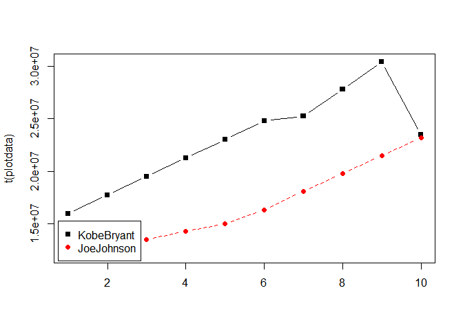<!-- -->


Difference between matrices and dataframe in R
-> In a matrix, all the data is stored is of the same type. In a dataframe however the data stored can be of different types.

```r
# Method 1- select the file manually
#stats<-read.csv(file.choose())
#stats
# Method 2-Set wd and read data
getwd()
```

```
## [1] "C:/Users/Aditi/Desktop/R-codes"
```

```r
setwd("C:\\Users\\Aditi\\Desktop\\R_github")
getwd()
```

```
## [1] "C:/Users/Aditi/Desktop/R_github"
```

```r
rm(stats)
```

```
## Warning in rm(stats): object 'stats' not found
```

```r
stats<-read.csv("DemographicData.csv")
stats
```

```
##                       Country.Name Country.Code Birth.rate Internet.users
## 1                            Aruba          ABW     10.244       78.90000
## 2                      Afghanistan          AFG     35.253        5.90000
## 3                           Angola          AGO     45.985       19.10000
## 4                          Albania          ALB     12.877       57.20000
## 5             United Arab Emirates          ARE     11.044       88.00000
## 6                        Argentina          ARG     17.716       59.90000
## 7                          Armenia          ARM     13.308       41.90000
## 8              Antigua and Barbuda          ATG     16.447       63.40000
## 9                        Australia          AUS     13.200       83.00000
## 10                         Austria          AUT      9.400       80.61880
## 11                      Azerbaijan          AZE     18.300       58.70000
## 12                         Burundi          BDI     44.151        1.30000
## 13                         Belgium          BEL     11.200       82.17020
## 14                           Benin          BEN     36.440        4.90000
## 15                    Burkina Faso          BFA     40.551        9.10000
## 16                      Bangladesh          BGD     20.142        6.63000
## 17                        Bulgaria          BGR      9.200       53.06150
## 18                         Bahrain          BHR     15.040       90.00004
## 19                    Bahamas, The          BHS     15.339       72.00000
## 20          Bosnia and Herzegovina          BIH      9.062       57.79000
## 21                         Belarus          BLR     12.500       54.17000
## 22                          Belize          BLZ     23.092       33.60000
## 23                         Bermuda          BMU     10.400       95.30000
## 24                         Bolivia          BOL     24.236       36.94000
## 25                          Brazil          BRA     14.931       51.04000
## 26                        Barbados          BRB     12.188       73.00000
## 27               Brunei Darussalam          BRN     16.405       64.50000
## 28                          Bhutan          BTN     18.134       29.90000
## 29                        Botswana          BWA     25.267       15.00000
## 30        Central African Republic          CAF     34.076        3.50000
## 31                          Canada          CAN     10.900       85.80000
## 32                     Switzerland          CHE     10.200       86.34000
## 33                           Chile          CHL     13.385       66.50000
## 34                           China          CHN     12.100       45.80000
## 35                   Cote d'Ivoire          CIV     37.320        8.40000
## 36                        Cameroon          CMR     37.236        6.40000
## 37                     Congo, Rep.          COG     37.011        6.60000
## 38                        Colombia          COL     16.076       51.70000
## 39                         Comoros          COM     34.326        6.50000
## 40                      Cabo Verde          CPV     21.625       37.50000
## 41                      Costa Rica          CRI     15.022       45.96000
## 42                            Cuba          CUB     10.400       27.93000
## 43                  Cayman Islands          CYM     12.500       74.10000
## 44                          Cyprus          CYP     11.436       65.45480
## 45                  Czech Republic          CZE     10.200       74.11040
## 46                         Germany          DEU      8.500       84.17000
## 47                        Djibouti          DJI     25.486        9.50000
## 48                         Denmark          DNK     10.000       94.62970
## 49              Dominican Republic          DOM     21.198       45.90000
## 50                         Algeria          DZA     24.738       16.50000
## 51                         Ecuador          ECU     21.070       40.35368
## 52                Egypt, Arab Rep.          EGY     28.032       29.40000
## 53                         Eritrea          ERI     34.800        0.90000
## 54                           Spain          ESP      9.100       71.63500
## 55                         Estonia          EST     10.300       79.40000
## 56                        Ethiopia          ETH     32.925        1.90000
## 57                         Finland          FIN     10.700       91.51440
## 58                            Fiji          FJI     20.463       37.10000
## 59                          France          FRA     12.300       81.91980
## 60           Micronesia, Fed. Sts.          FSM     23.511       27.80000
## 61                           Gabon          GAB     30.555        9.20000
## 62                  United Kingdom          GBR     12.200       89.84410
## 63                         Georgia          GEO     13.332       43.30000
## 64                           Ghana          GHA     33.131       12.30000
## 65                          Guinea          GIN     37.337        1.60000
## 66                     Gambia, The          GMB     42.525       14.00000
## 67                   Guinea-Bissau          GNB     37.503        3.10000
## 68               Equatorial Guinea          GNQ     35.362       16.40000
## 69                          Greece          GRC      8.500       59.86630
## 70                         Grenada          GRD     19.334       35.00000
## 71                       Greenland          GRL     14.500       65.80000
## 72                       Guatemala          GTM     27.465       19.70000
## 73                            Guam          GUM     17.389       65.40000
## 74                          Guyana          GUY     18.885       35.00000
## 75            Hong Kong SAR, China          HKG      7.900       74.20000
## 76                        Honduras          HND     21.593       17.80000
## 77                         Croatia          HRV      9.400       66.74760
## 78                           Haiti          HTI     25.345       10.60000
## 79                         Hungary          HUN      9.200       72.64390
## 80                       Indonesia          IDN     20.297       14.94000
## 81                           India          IND     20.291       15.10000
## 82                         Ireland          IRL     15.000       78.24770
## 83              Iran, Islamic Rep.          IRN     17.900       29.95000
## 84                            Iraq          IRQ     31.093        9.20000
## 85                         Iceland          ISL     13.400       96.54680
## 86                          Israel          ISR     21.300       70.80000
## 87                           Italy          ITA      8.500       58.45930
## 88                         Jamaica          JAM     13.540       37.10000
## 89                          Jordan          JOR     27.046       41.00000
## 90                           Japan          JPN      8.200       89.71000
## 91                      Kazakhstan          KAZ     22.730       54.00000
## 92                           Kenya          KEN     35.194       39.00000
## 93                 Kyrgyz Republic          KGZ     27.200       23.00000
## 94                        Cambodia          KHM     24.462        6.80000
## 95                        Kiribati          KIR     29.044       11.50000
## 96                     Korea, Rep.          KOR      8.600       84.77000
## 97                          Kuwait          KWT     20.575       75.46000
## 98                         Lao PDR          LAO     27.051       12.50000
## 99                         Lebanon          LBN     13.426       70.50000
## 100                        Liberia          LBR     35.521        3.20000
## 101                          Libya          LBY     21.425       16.50000
## 102                      St. Lucia          LCA     15.430       46.20000
## 103                  Liechtenstein          LIE      9.200       93.80000
## 104                      Sri Lanka          LKA     17.863       21.90000
## 105                        Lesotho          LSO     28.738        5.00000
## 106                      Lithuania          LTU     10.100       68.45290
## 107                     Luxembourg          LUX     11.300       93.77650
## 108                         Latvia          LVA     10.200       75.23440
## 109               Macao SAR, China          MAC     11.256       65.80000
## 110                        Morocco          MAR     21.023       56.00000
## 111                        Moldova          MDA     12.141       45.00000
## 112                     Madagascar          MDG     34.686        3.00000
## 113                       Maldives          MDV     21.447       44.10000
## 114                         Mexico          MEX     19.104       43.46000
## 115                 Macedonia, FYR          MKD     11.222       65.24000
## 116                           Mali          MLI     44.138        3.50000
## 117                          Malta          MLT      9.500       68.91380
## 118                        Myanmar          MMR     18.119        1.60000
## 119                     Montenegro          MNE     11.616       60.31000
## 120                       Mongolia          MNG     24.275       20.00000
## 121                     Mozambique          MOZ     39.705        5.40000
## 122                     Mauritania          MRT     33.801        6.20000
## 123                      Mauritius          MUS     10.900       39.00000
## 124                         Malawi          MWI     39.459        5.05000
## 125                       Malaysia          MYS     16.805       66.97000
## 126                        Namibia          NAM     29.937       13.90000
## 127                  New Caledonia          NCL     17.000       66.00000
## 128                          Niger          NER     49.661        1.70000
## 129                        Nigeria          NGA     40.045       38.00000
## 130                      Nicaragua          NIC     20.788       15.50000
## 131                    Netherlands          NLD     10.200       93.95640
## 132                         Norway          NOR     11.600       95.05340
## 133                          Nepal          NPL     20.923       13.30000
## 134                    New Zealand          NZL     13.120       82.78000
## 135                           Oman          OMN     20.419       66.45000
## 136                       Pakistan          PAK     29.582       10.90000
## 137                         Panama          PAN     19.680       44.03000
## 138                           Peru          PER     20.198       39.20000
## 139                    Philippines          PHL     23.790       37.00000
## 140               Papua New Guinea          PNG     28.899        6.50000
## 141                         Poland          POL      9.600       62.84920
## 142                    Puerto Rico          PRI     10.800       73.90000
## 143                       Portugal          PRT      7.900       62.09560
## 144                       Paraguay          PRY     21.588       36.90000
## 145               French Polynesia          PYF     16.393       56.80000
## 146                          Qatar          QAT     11.940       85.30000
## 147                        Romania          ROU      8.800       49.76450
## 148             Russian Federation          RUS     13.200       67.97000
## 149                         Rwanda          RWA     32.689        9.00000
## 150                   Saudi Arabia          SAU     20.576       60.50000
## 151                          Sudan          SDN     33.477       22.70000
## 152                        Senegal          SEN     38.533       13.10000
## 153                      Singapore          SGP      9.300       81.00000
## 154                Solomon Islands          SLB     30.578        8.00000
## 155                   Sierra Leone          SLE     36.729        1.70000
## 156                    El Salvador          SLV     17.476       23.10930
## 157                        Somalia          SOM     43.891        1.50000
## 158                         Serbia          SRB      9.200       51.50000
## 159                    South Sudan          SSD     37.126       14.10000
## 160          Sao Tome and Principe          STP     34.537       23.00000
## 161                       Suriname          SUR     18.455       37.40000
## 162                Slovak Republic          SVK     10.100       77.88260
## 163                       Slovenia          SVN     10.200       72.67560
## 164                         Sweden          SWE     11.800       94.78360
## 165                      Swaziland          SWZ     30.093       24.70000
## 166                     Seychelles          SYC     18.600       50.40000
## 167           Syrian Arab Republic          SYR     24.043       26.20000
## 168                           Chad          TCD     45.745        2.30000
## 169                           Togo          TGO     36.080        4.50000
## 170                       Thailand          THA     11.041       28.94000
## 171                     Tajikistan          TJK     30.792       16.00000
## 172                   Turkmenistan          TKM     21.322        9.60000
## 173                    Timor-Leste          TLS     35.755        1.10000
## 174                          Tonga          TON     25.409       35.00000
## 175            Trinidad and Tobago          TTO     14.590       63.80000
## 176                        Tunisia          TUN     19.800       43.80000
## 177                         Turkey          TUR     16.836       46.25000
## 178                       Tanzania          TZA     39.518        4.40000
## 179                         Uganda          UGA     43.474       16.20000
## 180                        Ukraine          UKR     11.100       41.00000
## 181                        Uruguay          URY     14.374       57.69000
## 182                  United States          USA     12.500       84.20000
## 183                     Uzbekistan          UZB     22.500       38.20000
## 184 St. Vincent and the Grenadines          VCT     16.306       52.00000
## 185                  Venezuela, RB          VEN     19.842       54.90000
## 186          Virgin Islands (U.S.)          VIR     10.700       45.30000
## 187                        Vietnam          VNM     15.537       43.90000
## 188                        Vanuatu          VUT     26.739       11.30000
## 189             West Bank and Gaza          PSE     30.394       46.60000
## 190                          Samoa          WSM     26.172       15.30000
## 191                    Yemen, Rep.          YEM     32.947       20.00000
## 192                   South Africa          ZAF     20.850       46.50000
## 193               Congo, Dem. Rep.          COD     42.394        2.20000
## 194                         Zambia          ZMB     40.471       15.40000
## 195                       Zimbabwe          ZWE     35.715       18.50000
##            Income.Group
## 1           High income
## 2            Low income
## 3   Upper middle income
## 4   Upper middle income
## 5           High income
## 6           High income
## 7   Lower middle income
## 8           High income
## 9           High income
## 10          High income
## 11  Upper middle income
## 12           Low income
## 13          High income
## 14           Low income
## 15           Low income
## 16  Lower middle income
## 17  Upper middle income
## 18          High income
## 19          High income
## 20  Upper middle income
## 21  Upper middle income
## 22  Upper middle income
## 23          High income
## 24  Lower middle income
## 25  Upper middle income
## 26          High income
## 27          High income
## 28  Lower middle income
## 29  Upper middle income
## 30           Low income
## 31          High income
## 32          High income
## 33          High income
## 34  Upper middle income
## 35  Lower middle income
## 36  Lower middle income
## 37  Lower middle income
## 38  Upper middle income
## 39           Low income
## 40  Lower middle income
## 41  Upper middle income
## 42  Upper middle income
## 43          High income
## 44          High income
## 45          High income
## 46          High income
## 47  Lower middle income
## 48          High income
## 49  Upper middle income
## 50  Upper middle income
## 51  Upper middle income
## 52  Lower middle income
## 53           Low income
## 54          High income
## 55          High income
## 56           Low income
## 57          High income
## 58  Upper middle income
## 59          High income
## 60  Lower middle income
## 61  Upper middle income
## 62          High income
## 63  Lower middle income
## 64  Lower middle income
## 65           Low income
## 66           Low income
## 67           Low income
## 68          High income
## 69          High income
## 70  Upper middle income
## 71          High income
## 72  Lower middle income
## 73          High income
## 74  Lower middle income
## 75          High income
## 76  Lower middle income
## 77          High income
## 78           Low income
## 79          High income
## 80  Lower middle income
## 81  Lower middle income
## 82          High income
## 83  Upper middle income
## 84  Upper middle income
## 85          High income
## 86          High income
## 87          High income
## 88  Upper middle income
## 89  Upper middle income
## 90          High income
## 91  Upper middle income
## 92  Lower middle income
## 93  Lower middle income
## 94           Low income
## 95  Lower middle income
## 96          High income
## 97          High income
## 98  Lower middle income
## 99  Upper middle income
## 100          Low income
## 101 Upper middle income
## 102 Upper middle income
## 103         High income
## 104 Lower middle income
## 105 Lower middle income
## 106         High income
## 107         High income
## 108         High income
## 109         High income
## 110 Lower middle income
## 111 Lower middle income
## 112          Low income
## 113 Upper middle income
## 114 Upper middle income
## 115 Upper middle income
## 116          Low income
## 117         High income
## 118 Lower middle income
## 119 Upper middle income
## 120 Upper middle income
## 121          Low income
## 122 Lower middle income
## 123 Upper middle income
## 124          Low income
## 125 Upper middle income
## 126 Upper middle income
## 127         High income
## 128          Low income
## 129 Lower middle income
## 130 Lower middle income
## 131         High income
## 132         High income
## 133          Low income
## 134         High income
## 135         High income
## 136 Lower middle income
## 137 Upper middle income
## 138 Upper middle income
## 139 Lower middle income
## 140 Lower middle income
## 141         High income
## 142         High income
## 143         High income
## 144 Upper middle income
## 145         High income
## 146         High income
## 147 Upper middle income
## 148         High income
## 149          Low income
## 150         High income
## 151 Lower middle income
## 152 Lower middle income
## 153         High income
## 154 Lower middle income
## 155          Low income
## 156 Lower middle income
## 157          Low income
## 158 Upper middle income
## 159          Low income
## 160 Lower middle income
## 161 Upper middle income
## 162         High income
## 163         High income
## 164         High income
## 165 Lower middle income
## 166         High income
## 167 Lower middle income
## 168          Low income
## 169          Low income
## 170 Upper middle income
## 171 Lower middle income
## 172 Upper middle income
## 173 Lower middle income
## 174 Upper middle income
## 175         High income
## 176 Upper middle income
## 177 Upper middle income
## 178          Low income
## 179          Low income
## 180 Lower middle income
## 181         High income
## 182         High income
## 183 Lower middle income
## 184 Upper middle income
## 185         High income
## 186         High income
## 187 Lower middle income
## 188 Lower middle income
## 189 Lower middle income
## 190 Lower middle income
## 191 Lower middle income
## 192 Upper middle income
## 193          Low income
## 194 Lower middle income
## 195          Low income
```

```r
nrow(stats)
```

```
## [1] 195
```

```r
ncol(stats)
```

```
## [1] 5
```

```r
head(stats,n=10)
```

```
##            Country.Name Country.Code Birth.rate Internet.users
## 1                 Aruba          ABW     10.244        78.9000
## 2           Afghanistan          AFG     35.253         5.9000
## 3                Angola          AGO     45.985        19.1000
## 4               Albania          ALB     12.877        57.2000
## 5  United Arab Emirates          ARE     11.044        88.0000
## 6             Argentina          ARG     17.716        59.9000
## 7               Armenia          ARM     13.308        41.9000
## 8   Antigua and Barbuda          ATG     16.447        63.4000
## 9             Australia          AUS     13.200        83.0000
## 10              Austria          AUT      9.400        80.6188
##           Income.Group
## 1          High income
## 2           Low income
## 3  Upper middle income
## 4  Upper middle income
## 5          High income
## 6          High income
## 7  Lower middle income
## 8          High income
## 9          High income
## 10         High income
```

```r
tail(stats,n=8)
```

```
##           Country.Name Country.Code Birth.rate Internet.users
## 188            Vanuatu          VUT     26.739           11.3
## 189 West Bank and Gaza          PSE     30.394           46.6
## 190              Samoa          WSM     26.172           15.3
## 191        Yemen, Rep.          YEM     32.947           20.0
## 192       South Africa          ZAF     20.850           46.5
## 193   Congo, Dem. Rep.          COD     42.394            2.2
## 194             Zambia          ZMB     40.471           15.4
## 195           Zimbabwe          ZWE     35.715           18.5
##            Income.Group
## 188 Lower middle income
## 189 Lower middle income
## 190 Lower middle income
## 191 Lower middle income
## 192 Upper middle income
## 193          Low income
## 194 Lower middle income
## 195          Low income
```

```r
str(stats) # str provides structure of data
```

```
## 'data.frame':	195 obs. of  5 variables:
##  $ Country.Name  : Factor w/ 195 levels "Afghanistan",..: 8 1 4 2 183 6 7 5 9 10 ...
##  $ Country.Code  : Factor w/ 195 levels "ABW","AFG","AGO",..: 1 2 3 4 5 6 7 8 9 10 ...
##  $ Birth.rate    : num  10.2 35.3 46 12.9 11 ...
##  $ Internet.users: num  78.9 5.9 19.1 57.2 88 ...
##  $ Income.Group  : Factor w/ 4 levels "High income",..: 1 2 4 4 1 1 3 1 1 1 ...
```

```r
# runif - random variables distributed uniformly
# rnorm- random variables distributed normally
summary(stats)
```

```
##               Country.Name  Country.Code   Birth.rate    Internet.users 
##  Afghanistan        :  1   ABW    :  1   Min.   : 7.90   Min.   : 0.90  
##  Albania            :  1   AFG    :  1   1st Qu.:12.12   1st Qu.:14.52  
##  Algeria            :  1   AGO    :  1   Median :19.68   Median :41.00  
##  Angola             :  1   ALB    :  1   Mean   :21.47   Mean   :42.08  
##  Antigua and Barbuda:  1   ARE    :  1   3rd Qu.:29.76   3rd Qu.:66.22  
##  Argentina          :  1   ARG    :  1   Max.   :49.66   Max.   :96.55  
##  (Other)            :189   (Other):189                                  
##               Income.Group
##  High income        :67   
##  Low income         :30   
##  Lower middle income:50   
##  Upper middle income:48   
##                           
##                           
## 
```

```r
head(stats)
```

```
##           Country.Name Country.Code Birth.rate Internet.users
## 1                Aruba          ABW     10.244           78.9
## 2          Afghanistan          AFG     35.253            5.9
## 3               Angola          AGO     45.985           19.1
## 4              Albania          ALB     12.877           57.2
## 5 United Arab Emirates          ARE     11.044           88.0
## 6            Argentina          ARG     17.716           59.9
##          Income.Group
## 1         High income
## 2          Low income
## 3 Upper middle income
## 4 Upper middle income
## 5         High income
## 6         High income
```

```r
stats$Internet.users[2]
```

```
## [1] 5.9
```

```r
levels(stats$Income.Group)
```

```
## [1] "High income"         "Low income"          "Lower middle income"
## [4] "Upper middle income"
```

```r
# Basic operations with a dataframe 
stats[1:10,] #subsetting
```

```
##            Country.Name Country.Code Birth.rate Internet.users
## 1                 Aruba          ABW     10.244        78.9000
## 2           Afghanistan          AFG     35.253         5.9000
## 3                Angola          AGO     45.985        19.1000
## 4               Albania          ALB     12.877        57.2000
## 5  United Arab Emirates          ARE     11.044        88.0000
## 6             Argentina          ARG     17.716        59.9000
## 7               Armenia          ARM     13.308        41.9000
## 8   Antigua and Barbuda          ATG     16.447        63.4000
## 9             Australia          AUS     13.200        83.0000
## 10              Austria          AUT      9.400        80.6188
##           Income.Group
## 1          High income
## 2           Low income
## 3  Upper middle income
## 4  Upper middle income
## 5          High income
## 6          High income
## 7  Lower middle income
## 8          High income
## 9          High income
## 10         High income
```

```r
stats[c(4,100),]
```

```
##     Country.Name Country.Code Birth.rate Internet.users
## 4        Albania          ALB     12.877           57.2
## 100      Liberia          LBR     35.521            3.2
##            Income.Group
## 4   Upper middle income
## 100          Low income
```

```r
# Remember how the [] works:
is.data.frame(stats[1,])  # no need for drop=F
```

```
## [1] TRUE
```

```r
is.data.frame(stats[,1])
```

```
## [1] FALSE
```

```r
is.data.frame(stats[,1,drop=F])
```

```
## [1] TRUE
```

```r
stats$MyCalc<-stats$Birth.rate*stats$Internet.users

# Recycling of vector- if length in multiples
stats$xyz=1:5

# Remove a column
stats$MyCalc<-NULL
stats$xyz<-NULL

# Filtering data frames
filter<-stats$Internet.users<2
stats[filter,]
```

```
##     Country.Name Country.Code Birth.rate Internet.users
## 12       Burundi          BDI     44.151            1.3
## 53       Eritrea          ERI     34.800            0.9
## 56      Ethiopia          ETH     32.925            1.9
## 65        Guinea          GIN     37.337            1.6
## 118      Myanmar          MMR     18.119            1.6
## 128        Niger          NER     49.661            1.7
## 155 Sierra Leone          SLE     36.729            1.7
## 157      Somalia          SOM     43.891            1.5
## 173  Timor-Leste          TLS     35.755            1.1
##            Income.Group
## 12           Low income
## 53           Low income
## 56           Low income
## 65           Low income
## 118 Lower middle income
## 128          Low income
## 155          Low income
## 157          Low income
## 173 Lower middle income
```

```r
stats[stats$Birth.rate>40,]
```

```
##         Country.Name Country.Code Birth.rate Internet.users
## 3             Angola          AGO     45.985           19.1
## 12           Burundi          BDI     44.151            1.3
## 15      Burkina Faso          BFA     40.551            9.1
## 66       Gambia, The          GMB     42.525           14.0
## 116             Mali          MLI     44.138            3.5
## 128            Niger          NER     49.661            1.7
## 129          Nigeria          NGA     40.045           38.0
## 157          Somalia          SOM     43.891            1.5
## 168             Chad          TCD     45.745            2.3
## 179           Uganda          UGA     43.474           16.2
## 193 Congo, Dem. Rep.          COD     42.394            2.2
## 194           Zambia          ZMB     40.471           15.4
##            Income.Group
## 3   Upper middle income
## 12           Low income
## 15           Low income
## 66           Low income
## 116          Low income
## 128          Low income
## 129 Lower middle income
## 157          Low income
## 168          Low income
## 179          Low income
## 193          Low income
## 194 Lower middle income
```

```r
stats[stats$Birth.rate>40 & stats$Internet.users<2,]
```

```
##     Country.Name Country.Code Birth.rate Internet.users Income.Group
## 12       Burundi          BDI     44.151            1.3   Low income
## 128        Niger          NER     49.661            1.7   Low income
## 157      Somalia          SOM     43.891            1.5   Low income
```

```r
stats[stats$Income.Group=="High Income",]
```

```
## [1] Country.Name   Country.Code   Birth.rate     Internet.users
## [5] Income.Group  
## <0 rows> (or 0-length row.names)
```

```r
levels(stats$Income.Group)
```

```
## [1] "High income"         "Low income"          "Lower middle income"
## [4] "Upper middle income"
```

```r
stats[stats$Country.Name=="Malta",]
```

```
##     Country.Name Country.Code Birth.rate Internet.users Income.Group
## 117        Malta          MLT        9.5        68.9138  High income
```

```r
#install.packages("ggplot2")
library("ggplot2")
qplot(data=stats,x=Internet.users)
```

```
## `stat_bin()` using `bins = 30`. Pick better value with `binwidth`.
```

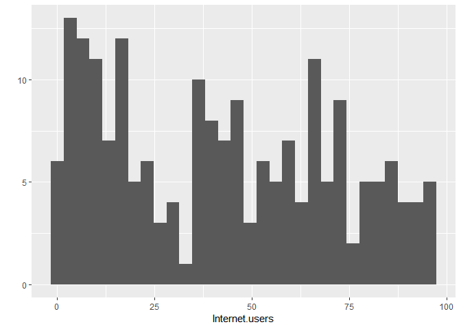<!-- -->

```r
qplot(data=stats,x=Income.Group,y=Birth.rate)
```

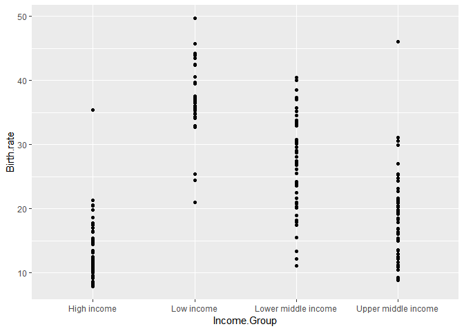<!-- -->

```r
# I is prefixed before size to tell that the label shouldn't be created for size as it is not a feature in the data
qplot(data=stats,x=Income.Group,y=Birth.rate,size=I(10))
```

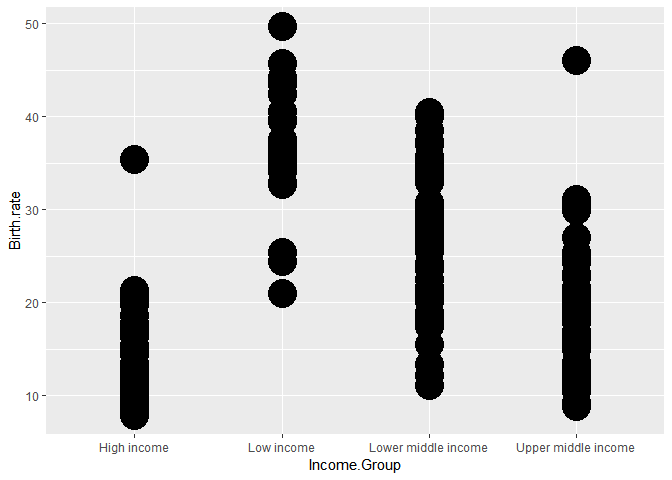<!-- -->

```r
qplot(data=stats,x=Income.Group,y=Birth.rate,color=I("Blue"))
```

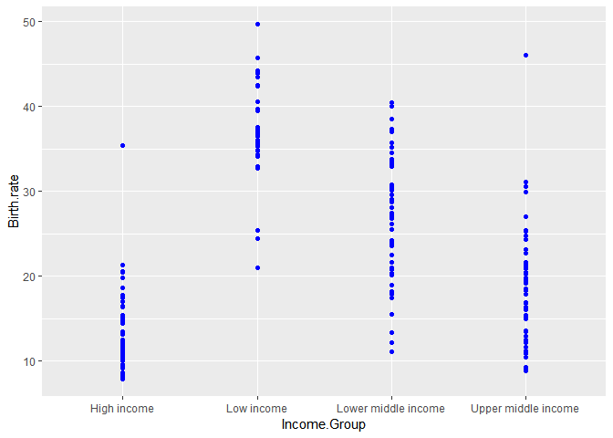<!-- -->

```r
qplot(data=stats,x=Income.Group,y=Birth.rate,geom="boxplot")
```

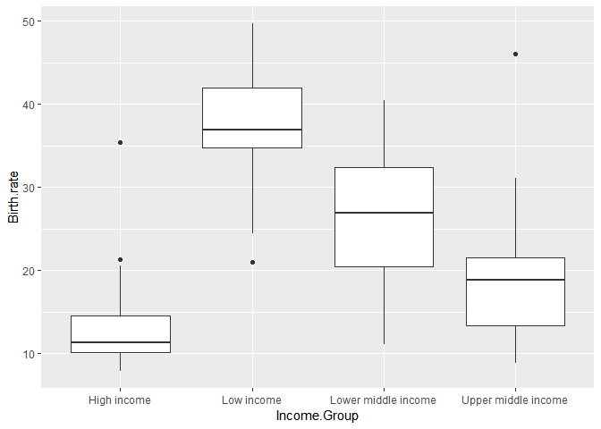<!-- -->

```r
qplot(data=stats,x=Internet.users,y=Birth.rate)
```

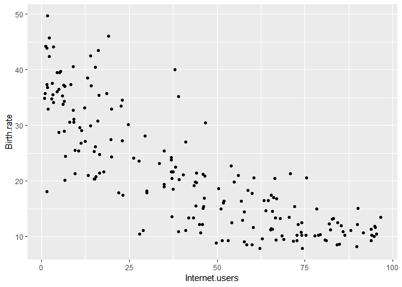<!-- -->

```r
qplot(data=stats,x=Internet.users,y=Birth.rate,size=I(4))
```

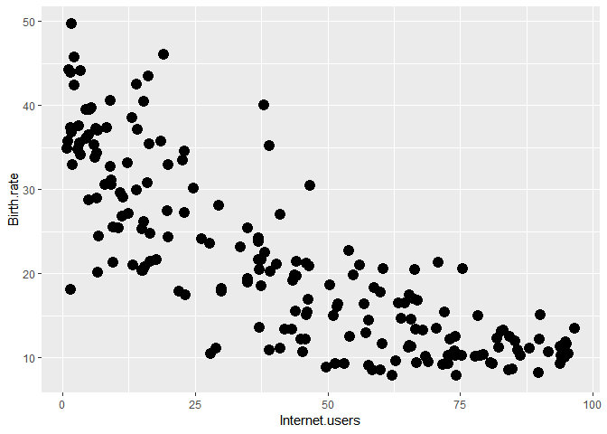<!-- -->

```r
qplot(data=stats,x=Internet.users,y=Birth.rate,size=I(4),color=Income.Group)
```

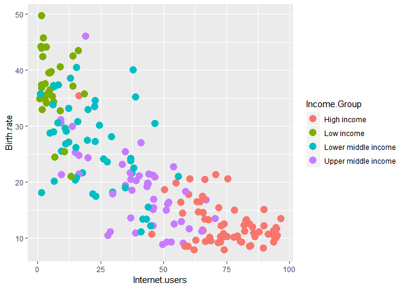<!-- -->

Importing data


```r
#Execute below code to generate three new vectors
Countries_2012_Dataset <- c("Aruba","Afghanistan","Angola","Albania","United Arab Emirates","Argentina","Armenia","Antigua and Barbuda","Australia","Austria","Azerbaijan","Burundi","Belgium","Benin","Burkina Faso","Bangladesh","Bulgaria","Bahrain","Bahamas, The","Bosnia and Herzegovina","Belarus","Belize","Bermuda","Bolivia","Brazil","Barbados","Brunei Darussalam","Bhutan","Botswana","Central African Republic","Canada","Switzerland","Chile","China","Cote d'Ivoire","Cameroon","Congo, Rep.","Colombia","Comoros","Cabo Verde","Costa Rica","Cuba","Cayman Islands","Cyprus","Czech Republic","Germany","Djibouti","Denmark","Dominican Republic","Algeria","Ecuador","Egypt, Arab Rep.","Eritrea","Spain","Estonia","Ethiopia","Finland","Fiji","France","Micronesia, Fed. Sts.","Gabon","United Kingdom","Georgia","Ghana","Guinea","Gambia, The","Guinea-Bissau","Equatorial Guinea","Greece","Grenada","Greenland","Guatemala","Guam","Guyana","Hong Kong SAR, China","Honduras","Croatia","Haiti","Hungary","Indonesia","India","Ireland","Iran, Islamic Rep.","Iraq","Iceland","Israel","Italy","Jamaica","Jordan","Japan","Kazakhstan","Kenya","Kyrgyz Republic","Cambodia","Kiribati","Korea, Rep.","Kuwait","Lao PDR","Lebanon","Liberia","Libya","St. Lucia","Liechtenstein","Sri Lanka","Lesotho","Lithuania","Luxembourg","Latvia","Macao SAR, China","Morocco","Moldova","Madagascar","Maldives","Mexico","Macedonia, FYR","Mali","Malta","Myanmar","Montenegro","Mongolia","Mozambique","Mauritania","Mauritius","Malawi","Malaysia","Namibia","New Caledonia","Niger","Nigeria","Nicaragua","Netherlands","Norway","Nepal","New Zealand","Oman","Pakistan","Panama","Peru","Philippines","Papua New Guinea","Poland","Puerto Rico","Portugal","Paraguay","French Polynesia","Qatar","Romania","Russian Federation","Rwanda","Saudi Arabia","Sudan","Senegal","Singapore","Solomon Islands","Sierra Leone","El Salvador","Somalia","Serbia","South Sudan","Sao Tome and Principe","Suriname","Slovak Republic","Slovenia","Sweden","Swaziland","Seychelles","Syrian Arab Republic","Chad","Togo","Thailand","Tajikistan","Turkmenistan","Timor-Leste","Tonga","Trinidad and Tobago","Tunisia","Turkey","Tanzania","Uganda","Ukraine","Uruguay","United States","Uzbekistan","St. Vincent and the Grenadines","Venezuela, RB","Virgin Islands (U.S.)","Vietnam","Vanuatu","West Bank and Gaza","Samoa","Yemen, Rep.","South Africa","Congo, Dem. Rep.","Zambia","Zimbabwe")
Codes_2012_Dataset <- c("ABW","AFG","AGO","ALB","ARE","ARG","ARM","ATG","AUS","AUT","AZE","BDI","BEL","BEN","BFA","BGD","BGR","BHR","BHS","BIH","BLR","BLZ","BMU","BOL","BRA","BRB","BRN","BTN","BWA","CAF","CAN","CHE","CHL","CHN","CIV","CMR","COG","COL","COM","CPV","CRI","CUB","CYM","CYP","CZE","DEU","DJI","DNK","DOM","DZA","ECU","EGY","ERI","ESP","EST","ETH","FIN","FJI","FRA","FSM","GAB","GBR","GEO","GHA","GIN","GMB","GNB","GNQ","GRC","GRD","GRL","GTM","GUM","GUY","HKG","HND","HRV","HTI","HUN","IDN","IND","IRL","IRN","IRQ","ISL","ISR","ITA","JAM","JOR","JPN","KAZ","KEN","KGZ","KHM","KIR","KOR","KWT","LAO","LBN","LBR","LBY","LCA","LIE","LKA","LSO","LTU","LUX","LVA","MAC","MAR","MDA","MDG","MDV","MEX","MKD","MLI","MLT","MMR","MNE","MNG","MOZ","MRT","MUS","MWI","MYS","NAM","NCL","NER","NGA","NIC","NLD","NOR","NPL","NZL","OMN","PAK","PAN","PER","PHL","PNG","POL","PRI","PRT","PRY","PYF","QAT","ROU","RUS","RWA","SAU","SDN","SEN","SGP","SLB","SLE","SLV","SOM","SRB","SSD","STP","SUR","SVK","SVN","SWE","SWZ","SYC","SYR","TCD","TGO","THA","TJK","TKM","TLS","TON","TTO","TUN","TUR","TZA","UGA","UKR","URY","USA","UZB","VCT","VEN","VIR","VNM","VUT","PSE","WSM","YEM","ZAF","COD","ZMB","ZWE")
Regions_2012_Dataset <- c("The Americas","Asia","Africa","Europe","Middle East","The Americas","Asia","The Americas","Oceania","Europe","Asia","Africa","Europe","Africa","Africa","Asia","Europe","Middle East","The Americas","Europe","Europe","The Americas","The Americas","The Americas","The Americas","The Americas","Asia","Asia","Africa","Africa","The Americas","Europe","The Americas","Asia","Africa","Africa","Africa","The Americas","Africa","Africa","The Americas","The Americas","The Americas","Europe","Europe","Europe","Africa","Europe","The Americas","Africa","The Americas","Africa","Africa","Europe","Europe","Africa","Europe","Oceania","Europe","Oceania","Africa","Europe","Asia","Africa","Africa","Africa","Africa","Africa","Europe","The Americas","The Americas","The Americas","Oceania","The Americas","Asia","The Americas","Europe","The Americas","Europe","Asia","Asia","Europe","Middle East","Middle East","Europe","Middle East","Europe","The Americas","Middle East","Asia","Asia","Africa","Asia","Asia","Oceania","Asia","Middle East","Asia","Middle East","Africa","Africa","The Americas","Europe","Asia","Africa","Europe","Europe","Europe","Asia","Africa","Europe","Africa","Asia","The Americas","Europe","Africa","Europe","Asia","Europe","Asia","Africa","Africa","Africa","Africa","Asia","Africa","Oceania","Africa","Africa","The Americas","Europe","Europe","Asia","Oceania","Middle East","Asia","The Americas","The Americas","Asia","Oceania","Europe","The Americas","Europe","The Americas","Oceania","Middle East","Europe","Europe","Africa","Middle East","Africa","Africa","Asia","Oceania","Africa","The Americas","Africa","Europe","Africa","Africa","The Americas","Europe","Europe","Europe","Africa","Africa","Middle East","Africa","Africa","Asia","Asia","Asia","Asia","Oceania","The Americas","Africa","Europe","Africa","Africa","Europe","The Americas","The Americas","Asia","The Americas","The Americas","The Americas","Asia","Oceania","Middle East","Oceania","Middle East","Africa","Africa","Africa","Africa")

# create a new dataframe
mydf<-data.frame(Countries_2012_Dataset,Codes_2012_Dataset,Regions_2012_Dataset)
head(mydf)
```

```
##   Countries_2012_Dataset Codes_2012_Dataset Regions_2012_Dataset
## 1                  Aruba                ABW         The Americas
## 2            Afghanistan                AFG                 Asia
## 3                 Angola                AGO               Africa
## 4                Albania                ALB               Europe
## 5   United Arab Emirates                ARE          Middle East
## 6              Argentina                ARG         The Americas
```

```r
colnames(mydf)<-c('country','code','region')
head(mydf)
```

```
##                country code       region
## 1                Aruba  ABW The Americas
## 2          Afghanistan  AFG         Asia
## 3               Angola  AGO       Africa
## 4              Albania  ALB       Europe
## 5 United Arab Emirates  ARE  Middle East
## 6            Argentina  ARG The Americas
```

```r
rm(mydf)

mydf<-data.frame(country=Countries_2012_Dataset,code=Codes_2012_Dataset,region=Regions_2012_Dataset)
head(mydf)
```

```
##                country code       region
## 1                Aruba  ABW The Americas
## 2          Afghanistan  AFG         Asia
## 3               Angola  AGO       Africa
## 4              Albania  ALB       Europe
## 5 United Arab Emirates  ARE  Middle East
## 6            Argentina  ARG The Americas
```

```r
tail(mydf)
```

```
##              country code      region
## 190            Samoa  WSM     Oceania
## 191      Yemen, Rep.  YEM Middle East
## 192     South Africa  ZAF      Africa
## 193 Congo, Dem. Rep.  COD      Africa
## 194           Zambia  ZMB      Africa
## 195         Zimbabwe  ZWE      Africa
```

```r
summary(mydf)
```

```
##                 country         code              region  
##  Afghanistan        :  1   ABW    :  1   Africa      :54  
##  Albania            :  1   AFG    :  1   Asia        :33  
##  Algeria            :  1   AGO    :  1   Europe      :42  
##  Angola             :  1   ALB    :  1   Middle East :14  
##  Antigua and Barbuda:  1   ARE    :  1   Oceania     :13  
##  Argentina          :  1   ARG    :  1   The Americas:39  
##  (Other)            :189   (Other):189
```


Merging data frames


```r
#-------------- Merging data frames
head(stats)
```

```
##           Country.Name Country.Code Birth.rate Internet.users
## 1                Aruba          ABW     10.244           78.9
## 2          Afghanistan          AFG     35.253            5.9
## 3               Angola          AGO     45.985           19.1
## 4              Albania          ALB     12.877           57.2
## 5 United Arab Emirates          ARE     11.044           88.0
## 6            Argentina          ARG     17.716           59.9
##          Income.Group
## 1         High income
## 2          Low income
## 3 Upper middle income
## 4 Upper middle income
## 5         High income
## 6         High income
```

```r
head(mydf)
```

```
##                country code       region
## 1                Aruba  ABW The Americas
## 2          Afghanistan  AFG         Asia
## 3               Angola  AGO       Africa
## 4              Albania  ALB       Europe
## 5 United Arab Emirates  ARE  Middle East
## 6            Argentina  ARG The Americas
```

```r
mergeddf<-merge(stats,mydf,by.x="Country.Code",by.y="code")
head(mergeddf)
```

```
##   Country.Code         Country.Name Birth.rate Internet.users
## 1          ABW                Aruba     10.244           78.9
## 2          AFG          Afghanistan     35.253            5.9
## 3          AGO               Angola     45.985           19.1
## 4          ALB              Albania     12.877           57.2
## 5          ARE United Arab Emirates     11.044           88.0
## 6          ARG            Argentina     17.716           59.9
##          Income.Group              country       region
## 1         High income                Aruba The Americas
## 2          Low income          Afghanistan         Asia
## 3 Upper middle income               Angola       Africa
## 4 Upper middle income              Albania       Europe
## 5         High income United Arab Emirates  Middle East
## 6         High income            Argentina The Americas
```

```r
mergeddf$Country=NULL
head(mergeddf)
```

```
##   Country.Code         Country.Name Birth.rate Internet.users
## 1          ABW                Aruba     10.244           78.9
## 2          AFG          Afghanistan     35.253            5.9
## 3          AGO               Angola     45.985           19.1
## 4          ALB              Albania     12.877           57.2
## 5          ARE United Arab Emirates     11.044           88.0
## 6          ARG            Argentina     17.716           59.9
##          Income.Group              country       region
## 1         High income                Aruba The Americas
## 2          Low income          Afghanistan         Asia
## 3 Upper middle income               Angola       Africa
## 4 Upper middle income              Albania       Europe
## 5         High income United Arab Emirates  Middle East
## 6         High income            Argentina The Americas
```

```r
str(mergeddf)
```

```
## 'data.frame':	195 obs. of  7 variables:
##  $ Country.Code  : Factor w/ 195 levels "ABW","AFG","AGO",..: 1 2 3 4 5 6 7 8 9 10 ...
##  $ Country.Name  : Factor w/ 195 levels "Afghanistan",..: 8 1 4 2 183 6 7 5 9 10 ...
##  $ Birth.rate    : num  10.2 35.3 46 12.9 11 ...
##  $ Internet.users: num  78.9 5.9 19.1 57.2 88 ...
##  $ Income.Group  : Factor w/ 4 levels "High income",..: 1 2 4 4 1 1 3 1 1 1 ...
##  $ country       : Factor w/ 195 levels "Afghanistan",..: 8 1 4 2 183 6 7 5 9 10 ...
##  $ region        : Factor w/ 6 levels "Africa","Asia",..: 6 2 1 3 4 6 2 6 5 3 ...
```

```r
tail(mergeddf)
```

```
##     Country.Code Country.Name Birth.rate Internet.users
## 190          VUT      Vanuatu     26.739           11.3
## 191          WSM        Samoa     26.172           15.3
## 192          YEM  Yemen, Rep.     32.947           20.0
## 193          ZAF South Africa     20.850           46.5
## 194          ZMB       Zambia     40.471           15.4
## 195          ZWE     Zimbabwe     35.715           18.5
##            Income.Group      country      region
## 190 Lower middle income      Vanuatu     Oceania
## 191 Lower middle income        Samoa     Oceania
## 192 Lower middle income  Yemen, Rep. Middle East
## 193 Upper middle income South Africa      Africa
## 194 Lower middle income       Zambia      Africa
## 195          Low income     Zimbabwe      Africa
```

```r
# -----------Visualising merged data
qplot(data=mergeddf,x=Internet.users,y=Birth.rate)
```

<!-- -->

```r
qplot(data=mergeddf,x=Internet.users,y=Birth.rate,color=region)
```

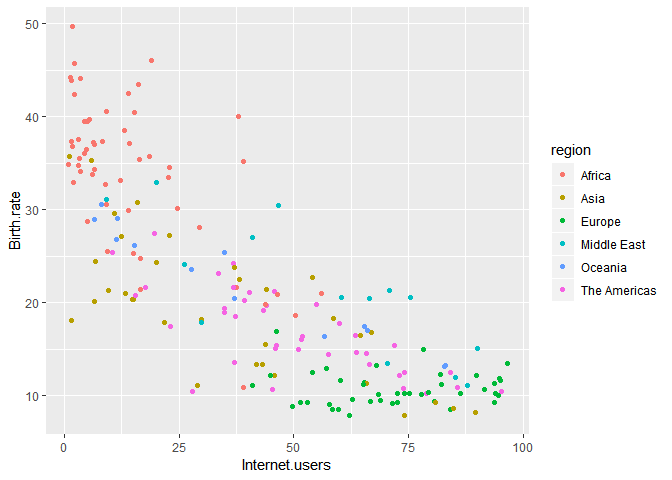<!-- -->

```r
#1.Shapes---------------
qplot(data=mergeddf,x=Internet.users,y=Birth.rate,color=region,size=I(5),shape=I(23))
```

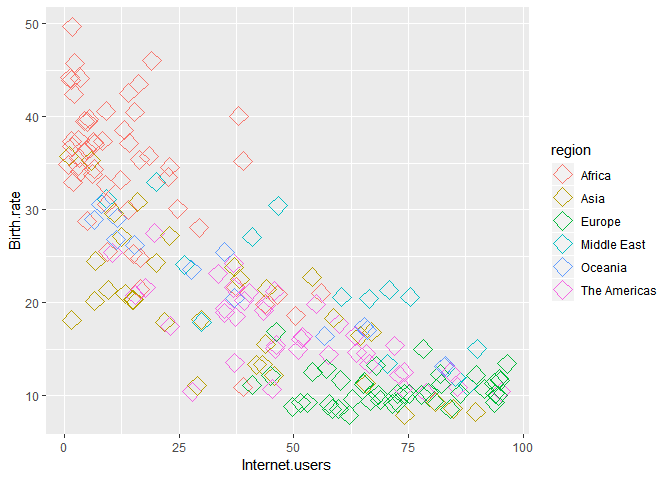<!-- -->

```r
#2.Transparency---------------
qplot(data=mergeddf,x=Internet.users,y=Birth.rate,color=region,size=I(5),shape=I(23),alpha=I(0.6))
```

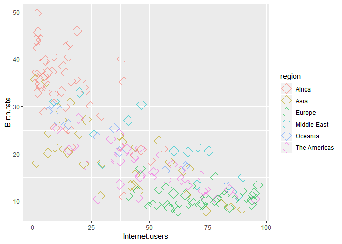<!-- -->

```r
#3.Title---------------
qplot(data=mergeddf,x=Internet.users,y=Birth.rate,color=region,size=I(5),shape=I(23),alpha=I(0.6),main="Birth rate vs Internet users")
```

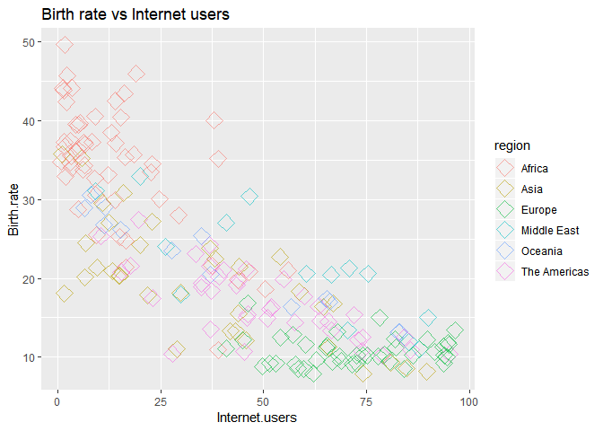<!-- -->

```r
setwd("C:\\Users\\Aditi\\Desktop\\R_github")
hfile1<-read.csv("Section5-Homework-Data.csv")
head(hfile1)
```

```
##           Country.Name Country.Code       Region Year Fertility.Rate
## 1                Aruba          ABW The Americas 1960          4.820
## 2          Afghanistan          AFG         Asia 1960          7.450
## 3               Angola          AGO       Africa 1960          7.379
## 4              Albania          ALB       Europe 1960          6.186
## 5 United Arab Emirates          ARE  Middle East 1960          6.928
## 6            Argentina          ARG The Americas 1960          3.109
```

Import data


```r
#Execute below code to generate three new vectors
Country_Code <- c("ABW","AFG","AGO","ALB","ARE","ARG","ARM","ATG","AUS","AUT","AZE","BDI","BEL","BEN","BFA","BGD","BGR","BHR","BHS","BIH","BLR","BLZ","BOL","BRA","BRB","BRN","BTN","BWA","CAF","CAN","CHE","CHL","CHN","CIV","CMR","COG","COL","COM","CPV","CRI","CUB","CYP","CZE","DEU","DJI","DNK","DOM","DZA","ECU","EGY","ERI","ESP","EST","ETH","FIN","FJI","FRA","FSM","GAB","GBR","GEO","GHA","GIN","GMB","GNB","GNQ","GRC","GRD","GTM","GUM","GUY","HKG","HND","HRV","HTI","HUN","IDN","IND","IRL","IRN","IRQ","ISL","ITA","JAM","JOR","JPN","KAZ","KEN","KGZ","KHM","KIR","KOR","KWT","LAO","LBN","LBR","LBY","LCA","LKA","LSO","LTU","LUX","LVA","MAC","MAR","MDA","MDG","MDV","MEX","MKD","MLI","MLT","MMR","MNE","MNG","MOZ","MRT","MUS","MWI","MYS","NAM","NCL","NER","NGA","NIC","NLD","NOR","NPL","NZL","OMN","PAK","PAN","PER","PHL","PNG","POL","PRI","PRT","PRY","PYF","QAT","ROU","RUS","RWA","SAU","SDN","SEN","SGP","SLB","SLE","SLV","SOM","SSD","STP","SUR","SVK","SVN","SWE","SWZ","SYR","TCD","TGO","THA","TJK","TKM","TLS","TON","TTO","TUN","TUR","TZA","UGA","UKR","URY","USA","UZB","VCT","VEN","VIR","VNM","VUT","WSM","YEM","ZAF","COD","ZMB","ZWE")
Life_Expectancy_At_Birth_1960 <- c(65.5693658536586,32.328512195122,32.9848292682927,62.2543658536585,52.2432195121951,65.2155365853659,65.8634634146342,61.7827317073171,70.8170731707317,68.5856097560976,60.836243902439,41.2360487804878,69.7019512195122,37.2782682926829,34.4779024390244,45.8293170731707,69.2475609756098,52.0893658536585,62.7290487804878,60.2762195121951,67.7080975609756,59.9613658536585,42.1183170731707,54.2054634146342,60.7380487804878,62.5003658536585,32.3593658536585,50.5477317073171,36.4826341463415,71.1331707317073,71.3134146341463,57.4582926829268,43.4658048780488,36.8724146341463,41.523756097561,48.5816341463415,56.716756097561,41.4424390243903,48.8564146341463,60.5761951219512,63.9046585365854,69.5939268292683,70.3487804878049,69.3129512195122,44.0212682926829,72.1765853658537,51.8452682926829,46.1351219512195,53.215,48.0137073170732,37.3629024390244,69.1092682926829,67.9059756097561,38.4057073170732,68.819756097561,55.9584878048781,69.8682926829268,57.5865853658537,39.5701219512195,71.1268292682927,63.4318536585366,45.8314634146342,34.8863902439024,32.0422195121951,37.8404390243902,36.7330487804878,68.1639024390244,59.8159268292683,45.5316341463415,61.2263414634146,60.2787317073171,66.9997073170732,46.2883170731707,64.6086585365854,42.1000975609756,68.0031707317073,48.6403170731707,41.1719512195122,69.691756097561,44.945512195122,48.0306829268293,73.4286585365854,69.1239024390244,64.1918292682927,52.6852682926829,67.6660975609756,58.3675853658537,46.3624146341463,56.1280731707317,41.2320243902439,49.2159756097561,53.0013170731707,60.3479512195122,43.2044634146342,63.2801219512195,34.7831707317073,42.6411951219512,57.303756097561,59.7471463414634,46.5107073170732,69.8473170731707,68.4463902439024,69.7868292682927,64.6609268292683,48.4466341463415,61.8127804878049,39.9746829268293,37.2686341463415,57.0656341463415,60.6228048780488,28.2116097560976,67.6017804878049,42.7363902439024,63.7056097560976,48.3688048780488,35.0037073170732,43.4830975609756,58.7452195121951,37.7736341463415,59.4753414634146,46.8803902439024,58.6390243902439,35.5150487804878,37.1829512195122,46.9988292682927,73.3926829268293,73.549756097561,35.1708292682927,71.2365853658537,42.6670731707317,45.2904634146342,60.8817073170732,47.6915853658537,57.8119268292683,38.462243902439,67.6804878048781,68.7196097560976,62.8089268292683,63.7937073170732,56.3570487804878,61.2060731707317,65.6424390243903,66.0552926829268,42.2492926829268,45.6662682926829,48.1876341463415,38.206,65.6598292682927,49.3817073170732,30.3315365853659,49.9479268292683,36.9658780487805,31.6767073170732,50.4513658536585,59.6801219512195,69.9759268292683,68.9780487804878,73.0056097560976,44.2337804878049,52.768243902439,38.0161219512195,40.2728292682927,54.6993170731707,56.1535365853659,54.4586829268293,33.7271219512195,61.3645365853659,62.6575853658537,42.009756097561,45.3844146341463,43.6538780487805,43.9835609756098,68.2995365853659,67.8963902439025,69.7707317073171,58.8855365853659,57.7238780487805,59.2851219512195,63.7302195121951,59.0670243902439,46.4874878048781,49.969512195122,34.3638048780488,49.0362926829268,41.0180487804878,45.1098048780488,51.5424634146342)
Life_Expectancy_At_Birth_2013 <- c(75.3286585365854,60.0282682926829,51.8661707317073,77.537243902439,77.1956341463415,75.9860975609756,74.5613658536585,75.7786585365854,82.1975609756098,80.890243902439,70.6931463414634,56.2516097560976,80.3853658536585,59.3120243902439,58.2406341463415,71.245243902439,74.4658536585366,76.5459512195122,75.0735365853659,76.2769268292683,72.4707317073171,69.9820487804878,67.9134390243903,74.1224390243903,75.3339512195122,78.5466585365854,69.1029268292683,64.3608048780488,49.8798780487805,81.4011219512195,82.7487804878049,81.1979268292683,75.3530243902439,51.2084634146342,55.0418048780488,61.6663902439024,73.8097317073171,62.9321707317073,72.9723658536585,79.2252195121951,79.2563902439025,79.9497804878049,78.2780487804878,81.0439024390244,61.6864634146342,80.3024390243903,73.3199024390244,74.5689512195122,75.648512195122,70.9257804878049,63.1778780487805,82.4268292682927,76.4243902439025,63.4421951219512,80.8317073170732,69.9179268292683,81.9682926829268,68.9733902439024,63.8435853658537,80.9560975609756,74.079512195122,61.1420731707317,58.216487804878,59.9992682926829,54.8384146341464,57.2908292682927,80.6341463414634,73.1935609756098,71.4863902439024,78.872512195122,66.3100243902439,83.8317073170732,72.9428536585366,77.1268292682927,62.4011463414634,75.2682926829268,68.7046097560976,67.6604146341463,81.0439024390244,75.1259756097561,69.4716829268293,83.1170731707317,82.290243902439,73.4689268292683,73.9014146341463,83.3319512195122,70.45,60.9537804878049,70.2024390243902,67.7720487804878,65.7665853658537,81.459756097561,74.462756097561,65.687243902439,80.1288780487805,60.5203902439024,71.6576829268293,74.9127073170732,74.2402926829268,49.3314634146342,74.1634146341464,81.7975609756098,73.9804878048781,80.3391463414634,73.7090487804878,68.811512195122,64.6739024390244,76.6026097560976,76.5326585365854,75.1870487804878,57.5351951219512,80.7463414634146,65.6540975609756,74.7583658536585,69.0618048780488,54.641512195122,62.8027073170732,74.46,61.466,74.567512195122,64.3438780487805,77.1219512195122,60.8281463414634,52.4421463414634,74.514756097561,81.1048780487805,81.4512195121951,69.222,81.4073170731707,76.8410487804878,65.9636829268293,77.4192195121951,74.2838536585366,68.1315609756097,62.4491707317073,76.8487804878049,78.7111951219512,80.3731707317073,72.7991707317073,76.3340731707317,78.4184878048781,74.4634146341463,71.0731707317073,63.3948292682927,74.1776341463415,63.1670487804878,65.878756097561,82.3463414634146,67.7189268292683,50.3631219512195,72.4981463414634,55.0230243902439,55.2209024390244,66.259512195122,70.99,76.2609756097561,80.2780487804878,81.7048780487805,48.9379268292683,74.7157804878049,51.1914878048781,59.1323658536585,74.2469268292683,69.4001707317073,65.4565609756098,67.5223658536585,72.6403414634147,70.3052926829268,73.6463414634147,75.1759512195122,64.2918292682927,57.7676829268293,71.159512195122,76.8361951219512,78.8414634146341,68.2275853658537,72.8108780487805,74.0744146341464,79.6243902439024,75.756487804878,71.669243902439,73.2503902439024,63.583512195122,56.7365853658537,58.2719268292683,59.2373658536585,55.633)
```

Graphs


```r
str(Country_Code)
```

```
##  chr [1:187] "ABW" "AFG" "AGO" "ALB" "ARE" "ARG" "ARM" "ATG" "AUS" ...
```

```r
str(hfile1)
```

```
## 'data.frame':	374 obs. of  5 variables:
##  $ Country.Name  : Factor w/ 187 levels "Afghanistan",..: 8 1 4 2 176 6 7 5 9 10 ...
##  $ Country.Code  : Factor w/ 187 levels "ABW","AFG","AGO",..: 1 2 3 4 5 6 7 8 9 10 ...
##  $ Region        : Factor w/ 6 levels "Africa","Asia",..: 6 2 1 3 4 6 2 6 5 3 ...
##  $ Year          : int  1960 1960 1960 1960 1960 1960 1960 1960 1960 1960 ...
##  $ Fertility.Rate: num  4.82 7.45 7.38 6.19 6.93 ...
```

```r
hfile_1960<-hfile1[hfile1$Year==1960,]
hfile_2013<-hfile1[hfile1$Year==2013,]
summary(hfile1)
```

```
##               Country.Name  Country.Code          Region         Year     
##  Afghanistan        :  2   ABW    :  2   Africa      :106   Min.   :1960  
##  Albania            :  2   AFG    :  2   Asia        : 66   1st Qu.:1960  
##  Algeria            :  2   AGO    :  2   Europe      : 80   Median :1986  
##  Angola             :  2   ALB    :  2   Middle East : 24   Mean   :1986  
##  Antigua and Barbuda:  2   ARE    :  2   Oceania     : 26   3rd Qu.:2013  
##  Argentina          :  2   ARG    :  2   The Americas: 72   Max.   :2013  
##  (Other)            :362   (Other):362                                    
##  Fertility.Rate 
##  Min.   :1.124  
##  1st Qu.:2.243  
##  Median :3.994  
##  Mean   :4.191  
##  3rd Qu.:6.252  
##  Max.   :8.187  
## 
```

```r
str(hfile_1960)
```

```
## 'data.frame':	187 obs. of  5 variables:
##  $ Country.Name  : Factor w/ 187 levels "Afghanistan",..: 8 1 4 2 176 6 7 5 9 10 ...
##  $ Country.Code  : Factor w/ 187 levels "ABW","AFG","AGO",..: 1 2 3 4 5 6 7 8 9 10 ...
##  $ Region        : Factor w/ 6 levels "Africa","Asia",..: 6 2 1 3 4 6 2 6 5 3 ...
##  $ Year          : int  1960 1960 1960 1960 1960 1960 1960 1960 1960 1960 ...
##  $ Fertility.Rate: num  4.82 7.45 7.38 6.19 6.93 ...
```

```r
str(hfile_2013)
```

```
## 'data.frame':	187 obs. of  5 variables:
##  $ Country.Name  : Factor w/ 187 levels "Afghanistan",..: 8 1 4 2 176 6 7 5 9 10 ...
##  $ Country.Code  : Factor w/ 187 levels "ABW","AFG","AGO",..: 1 2 3 4 5 6 7 8 9 10 ...
##  $ Region        : Factor w/ 6 levels "Africa","Asia",..: 6 2 1 3 4 6 2 6 5 3 ...
##  $ Year          : int  2013 2013 2013 2013 2013 2013 2013 2013 2013 2013 ...
##  $ Fertility.Rate: num  1.67 5.05 6.16 1.77 1.8 ...
```

```r
newfile=data.frame(Country_Code,Life_Expectancy_At_Birth_1960,Life_Expectancy_At_Birth_2013)
merged_1960=merge(hfile_1960,newfile,by.x="Country.Code",by.y="Country_Code")
merged_1960$Life_Expectancy_At_Birth_2013<-NULL
merged_2013=merge(hfile_2013,newfile,by.x="Country.Code",by.y="Country_Code")
merged_2013$Life_Expectancy_At_Birth_1960<-NULL

qplot(data=merged_1960,x=Fertility.Rate,y=Life_Expectancy_At_Birth_1960,color=Region)
```

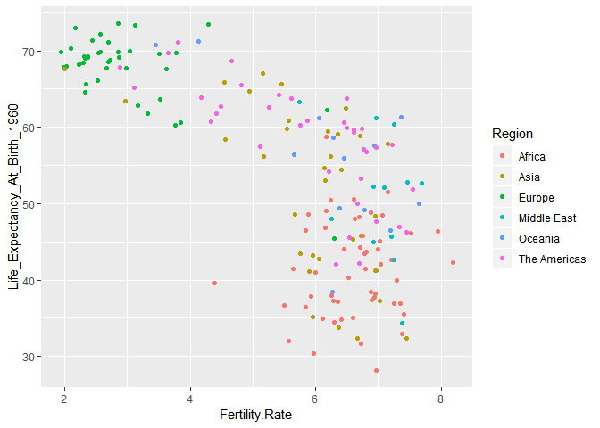<!-- -->

```r
# Layers in a graph
# Data
# Aeshetics
# Geometries
# Statistics
# Facets
# Coordinates
# Theme

# Import data- method1
setwd("C:\\Users\\Aditi\\Desktop\\R_github")
movie_rating<-read.csv('Movie-Ratings.csv')
head(movie_rating)
```

```
##                    Film     Genre Rotten.Tomatoes.Ratings..
## 1 (500) Days of Summer     Comedy                        87
## 2           10,000 B.C. Adventure                         9
## 3            12 Rounds     Action                        30
## 4             127 Hours Adventure                        93
## 5             17 Again     Comedy                        55
## 6                  2012    Action                        39
##   Audience.Ratings.. Budget..million... Year.of.release
## 1                 81                  8            2009
## 2                 44                105            2008
## 3                 52                 20            2009
## 4                 84                 18            2010
## 5                 70                 20            2009
## 6                 63                200            2009
```

```r
colnames(movie_rating)<-c("Film","Genre","CriticRating","AudienceRating","BudgetMillions","Year")
head(movie_rating)
```

```
##                    Film     Genre CriticRating AudienceRating
## 1 (500) Days of Summer     Comedy           87             81
## 2           10,000 B.C. Adventure            9             44
## 3            12 Rounds     Action           30             52
## 4             127 Hours Adventure           93             84
## 5             17 Again     Comedy           55             70
## 6                  2012    Action           39             63
##   BudgetMillions Year
## 1              8 2009
## 2            105 2008
## 3             20 2009
## 4             18 2010
## 5             20 2009
## 6            200 2009
```

```r
tail(movie_rating)
```

```
##                           Film    Genre CriticRating AudienceRating
## 557              Your Highness   Comedy           26             36
## 558            Youth in Revolt   Comedy           68             52
## 559 Zack and Miri Make a Porno  Romance           64             70
## 560                     Zodiac Thriller           89             73
## 561                Zombieland    Action           90             87
## 562                  Zookeeper   Comedy           14             42
##     BudgetMillions Year
## 557             50 2011
## 558             18 2009
## 559             24 2008
## 560             65 2007
## 561             24 2009
## 562             80 2011
```

```r
str(movie_rating)
```

```
## 'data.frame':	562 obs. of  6 variables:
##  $ Film          : Factor w/ 562 levels "(500) Days of Summer ",..: 1 2 3 4 5 6 7 8 9 10 ...
##  $ Genre         : Factor w/ 7 levels "Action","Adventure",..: 3 2 1 2 3 1 3 5 3 3 ...
##  $ CriticRating  : int  87 9 30 93 55 39 40 50 43 93 ...
##  $ AudienceRating: int  81 44 52 84 70 63 71 57 48 93 ...
##  $ BudgetMillions: int  8 105 20 18 20 200 30 32 28 8 ...
##  $ Year          : int  2009 2008 2009 2010 2009 2009 2008 2007 2011 2011 ...
```

```r
summary(movie_rating)
```

```
##                     Film           Genre      CriticRating 
##  (500) Days of Summer :  1   Action   :154   Min.   : 0.0  
##  10,000 B.C.          :  1   Adventure: 29   1st Qu.:25.0  
##  12 Rounds            :  1   Comedy   :172   Median :46.0  
##  127 Hours            :  1   Drama    :101   Mean   :47.4  
##  17 Again             :  1   Horror   : 49   3rd Qu.:70.0  
##  2012                 :  1   Romance  : 21   Max.   :97.0  
##  (Other)              :556   Thriller : 36                 
##  AudienceRating  BudgetMillions       Year     
##  Min.   : 0.00   Min.   :  0.0   Min.   :2007  
##  1st Qu.:47.00   1st Qu.: 20.0   1st Qu.:2008  
##  Median :58.00   Median : 35.0   Median :2009  
##  Mean   :58.83   Mean   : 50.1   Mean   :2009  
##  3rd Qu.:72.00   3rd Qu.: 65.0   3rd Qu.:2010  
##  Max.   :96.00   Max.   :300.0   Max.   :2011  
## 
```

```r
# As can be seen above Year is treated ascontinuous numeric, we would convert it into categprical factor variable for the purpose of our analysis
# -----------converting numeric to factor
movie_rating$Year<-factor(movie_rating$Year)

summary(movie_rating)
```

```
##                     Film           Genre      CriticRating 
##  (500) Days of Summer :  1   Action   :154   Min.   : 0.0  
##  10,000 B.C.          :  1   Adventure: 29   1st Qu.:25.0  
##  12 Rounds            :  1   Comedy   :172   Median :46.0  
##  127 Hours            :  1   Drama    :101   Mean   :47.4  
##  17 Again             :  1   Horror   : 49   3rd Qu.:70.0  
##  2012                 :  1   Romance  : 21   Max.   :97.0  
##  (Other)              :556   Thriller : 36                 
##  AudienceRating  BudgetMillions    Year    
##  Min.   : 0.00   Min.   :  0.0   2007: 79  
##  1st Qu.:47.00   1st Qu.: 20.0   2008:125  
##  Median :58.00   Median : 35.0   2009:116  
##  Mean   :58.83   Mean   : 50.1   2010:119  
##  3rd Qu.:72.00   3rd Qu.: 65.0   2011:123  
##  Max.   :96.00   Max.   :300.0             
## 
```

```r
str(movie_rating)
```

```
## 'data.frame':	562 obs. of  6 variables:
##  $ Film          : Factor w/ 562 levels "(500) Days of Summer ",..: 1 2 3 4 5 6 7 8 9 10 ...
##  $ Genre         : Factor w/ 7 levels "Action","Adventure",..: 3 2 1 2 3 1 3 5 3 3 ...
##  $ CriticRating  : int  87 9 30 93 55 39 40 50 43 93 ...
##  $ AudienceRating: int  81 44 52 84 70 63 71 57 48 93 ...
##  $ BudgetMillions: int  8 105 20 18 20 200 30 32 28 8 ...
##  $ Year          : Factor w/ 5 levels "2007","2008",..: 3 2 3 4 3 3 2 1 5 5 ...
```

```r
library(ggplot2)

ggplot(data=movie_rating,aes(x=CriticRating,y=AudienceRating))
```

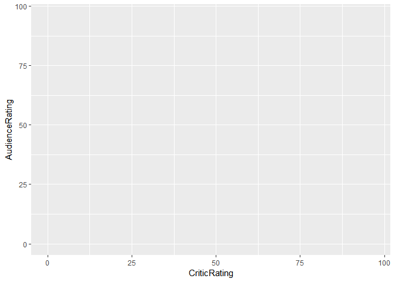<!-- -->

```r
# add geometry to the blank slate
ggplot(data=movie_rating,aes(x=CriticRating,y=AudienceRating,color=Genre,size=BudgetMillions))+geom_point()
```

<!-- -->

```r
# Plotting with layers

# creating an object

p<- ggplot(data=movie_rating,aes(x=CriticRating,y=AudienceRating,color=Genre,size=BudgetMillions))

# point

p+geom_point()
```

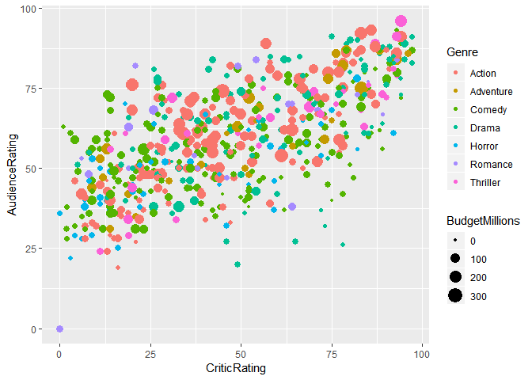<!-- -->

```r
#lines

p+geom_line()
```

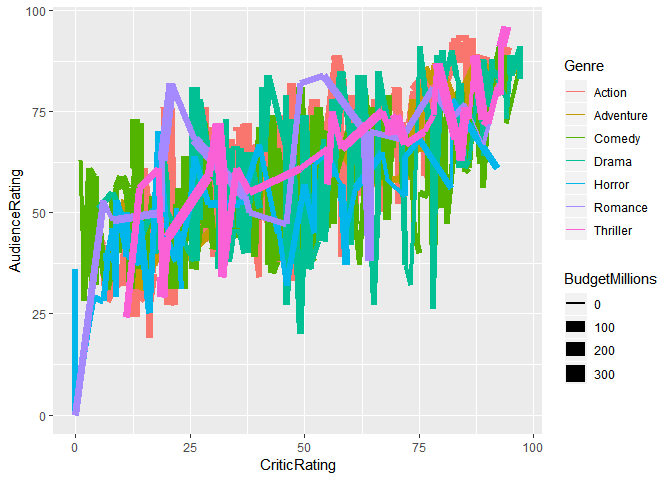<!-- -->

```r
# overririding aesthetics

p+geom_point(aes(size=CriticRating))
```

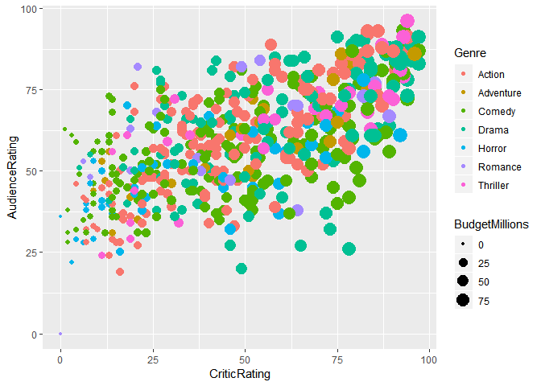<!-- -->

```r
p+geom_point(aes(color=BudgetMillions))
```

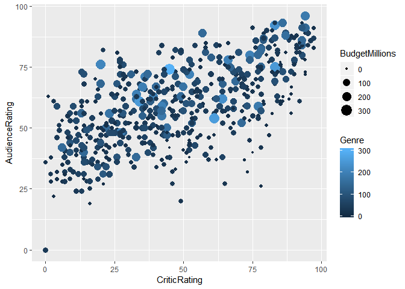<!-- -->

```r
#P remains the same ----------------
p+geom_point()
```

<!-- -->

```r
# you can change the x axis and y axis as well--------------
p+geom_point(aes(x=BudgetMillions))
```

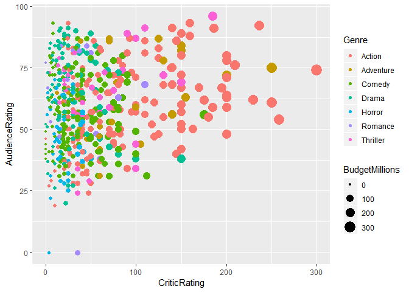<!-- -->

```r
#----- not that axis name hasn't changed

# use below line to correct for this--------
p+geom_point(aes(x=BudgetMillions))+xlab("Budget in Millions")
```

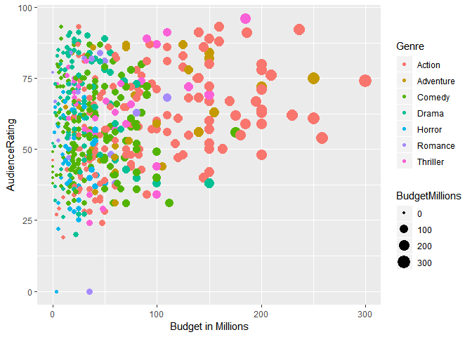<!-- -->

```r
#------ Mapping vs Setting

r<-ggplot(data=movie_rating,aes(x=CriticRating,y=AudienceRating))
r+geom_point()
```

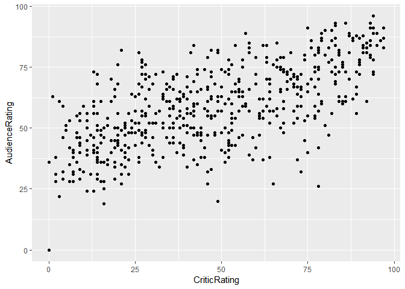<!-- -->

```r
# Add color
# Mapping
r+geom_point(aes(color=Genre))
```

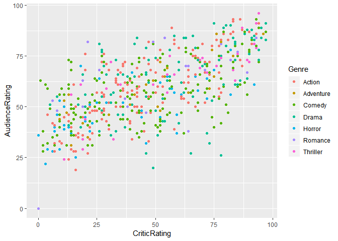<!-- -->

```r
# Setting
r+geom_point(color="DarkGreen")
```

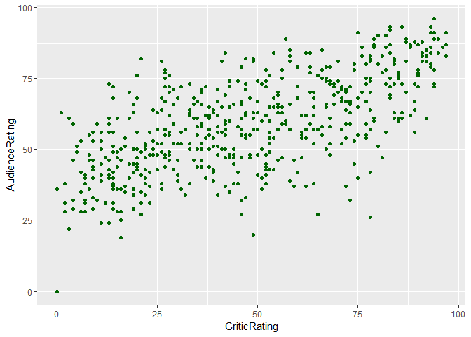<!-- -->

```r
# Histograms and Density charts-------------
s<-ggplot(data=movie_rating,aes(x=BudgetMillions))
s+geom_histogram(binwidth=10)
```

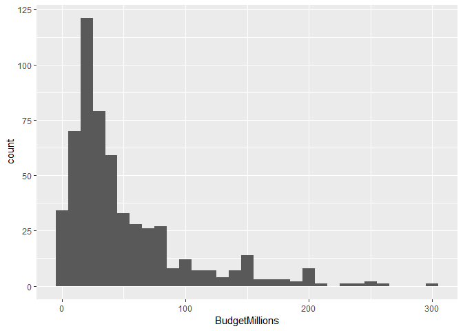<!-- -->

```r
#add color 
s+geom_histogram(binwidth=10,aes(fill=Genre),color="Black")
```

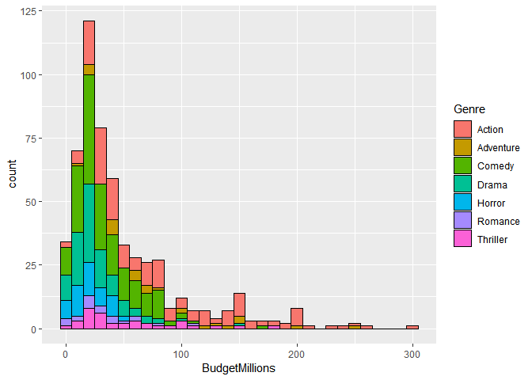<!-- -->

```r
# Density charts-----------------
s+geom_density(aes(fill=Genre))
```

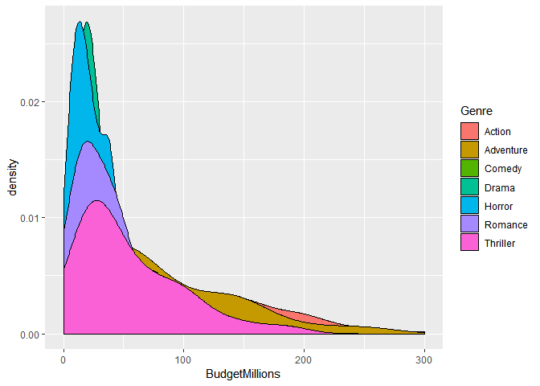<!-- -->

```r
# Statistical transformations

u<-ggplot(data=movie_rating,aes(x=CriticRating,y=AudienceRating,color=Genre))
u+geom_point()+geom_smooth(fill=NA)
```

```
## `geom_smooth()` using method = 'loess' and formula 'y ~ x'
```

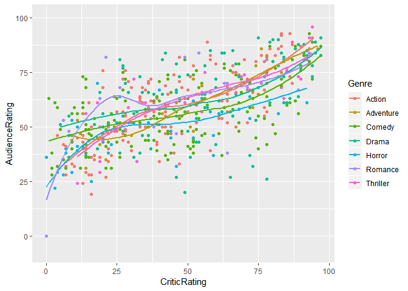<!-- -->

```r
## `geom_smooth()` using method = 'loess' and formula 'y ~ x'
#boxplots

u<-ggplot(data=movie_rating,aes(x=Genre,y=AudienceRating,color=Genre))
u+geom_boxplot()
```

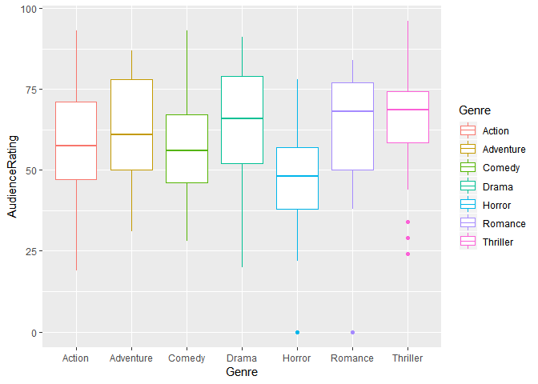<!-- -->

```r
u+geom_boxplot(size=1.2)+geom_point()
```

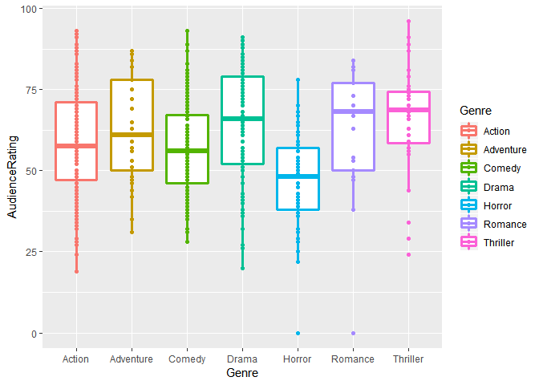<!-- -->

```r
u+geom_boxplot(size=1.2)+geom_jitter()
```

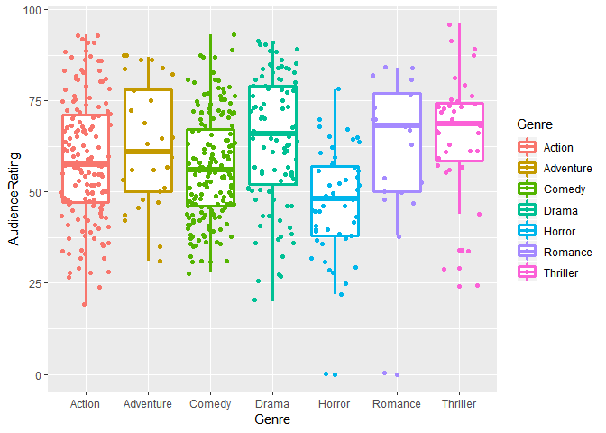<!-- -->

```r
u+geom_jitter()+geom_boxplot(size=1.2,alpha=0.5)
```

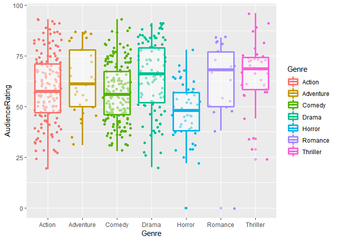<!-- -->

```r
# using facets-----------------------------

v<-ggplot(data=movie_rating,aes(x=BudgetMillions))
# facet_grid(rows~columns)
v+geom_histogram(binwidth=10,aes(fill=Genre),color="Black")+facet_grid(Genre~.,scales="free")
```

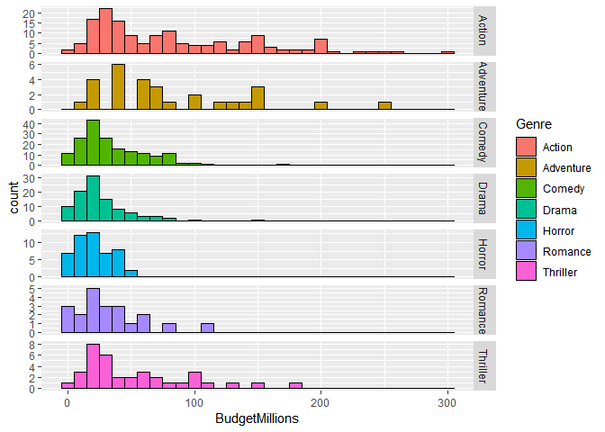<!-- -->

```r
# scatterplots

w<-ggplot(data=movie_rating,aes(x=CriticRating,y=AudienceRating,color=Genre))
w+geom_point(size=3)
```

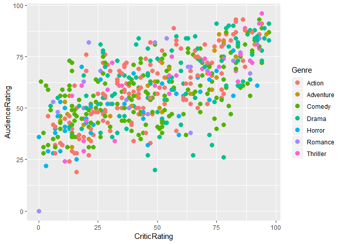<!-- -->

```r
#facets
w+geom_point(size=3)+facet_grid(Genre~.)
```

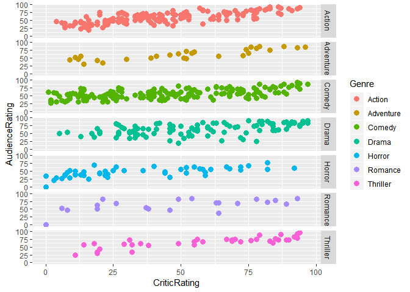<!-- -->

```r
w+geom_point(size=3)+facet_grid(.~Year)
```

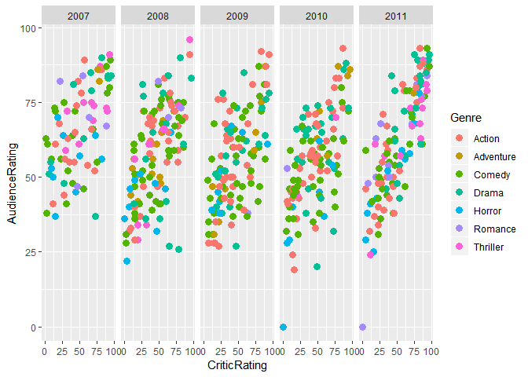<!-- -->

```r
w+geom_point(size=1)+facet_grid(Genre~Year)
```

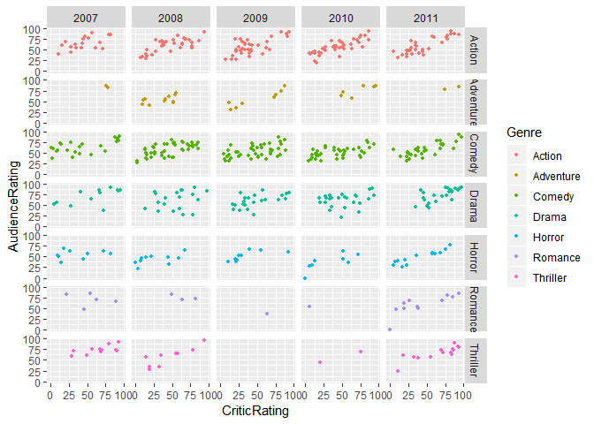<!-- -->

```r
# limiting the coordinates ------------------

m<-ggplot(data=movie_rating,aes(x=CriticRating,y=AudienceRating,size=BudgetMillions,color=Genre))
m+geom_point()
```

<!-- -->

```r
m+geom_point()+xlim(50,100)+ylim(50,100)
```

```
## Warning: Removed 335 rows containing missing values (geom_point).
```

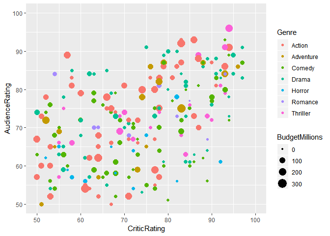<!-- -->

```r
n<-ggplot(movie_rating,aes(x=BudgetMillions))
n+geom_histogram(binwidth=10,aes(fill=Genre),color="Black")+coord_cartesian(ylim=c(0,50))
```

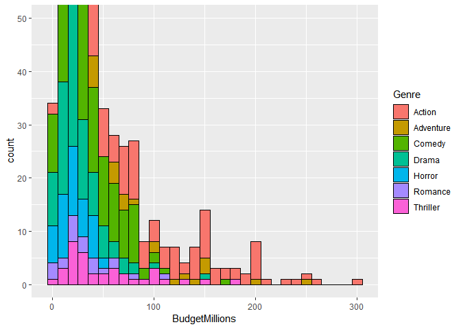<!-- -->

```r
#------------------Theme
o<-ggplot(data=movie_rating,aes(x=BudgetMillions))
h<-o+geom_histogram(binwidth=10,aes(fill=Genre),color="Black")
h
```

<!-- -->

```r
# axis labels---------
h+xlab("Money Axis")+ylab("Number of Movies")
```

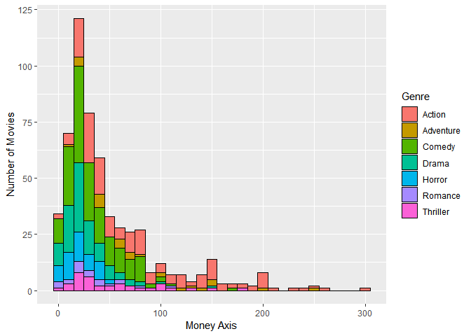<!-- -->

```r
# Label formatting
h+xlab("Money Axis")+ylab("Number of Movies")+theme(axis.title.x = element_text(color="DarkGreen",size=30),
                                                    axis.title.y = element_text(color="Red",size=30))
```

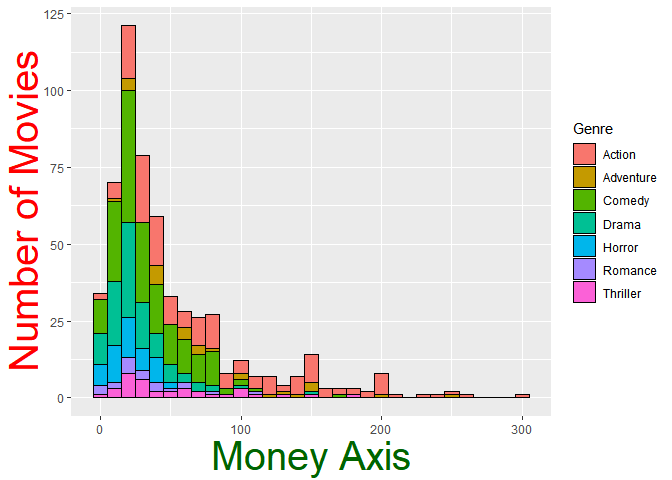<!-- -->

```r
#tick mark formatting

h+xlab("Money axis")+ylab("No of movies")+
  ggtitle("Title1")+
  theme(axis.title.x=element_text(color="DarkGreen",size=30),
                          axis.title.y = element_text(color="Red",size=30),
                          axis.text.x=element_text(size=20),
                          axis.text.y=element_text(size=20),
                          legend.title = element_text(size=30),
                          legend.text=element_text(size=20),
                          legend.position = c(1,1),
                          legend.justification = c(1,1),
        plot.title = element_text(color="DarkBlue",size=40,family="Courier")
                          
                          )
```

```
## Warning in grid.Call(C_textBounds, as.graphicsAnnot(x$label), x$x, x$y, :
## font family not found in Windows font database
```

```
## Warning in grid.Call(C_textBounds, as.graphicsAnnot(x$label), x$x, x$y, :
## font family not found in Windows font database

## Warning in grid.Call(C_textBounds, as.graphicsAnnot(x$label), x$x, x$y, :
## font family not found in Windows font database
```

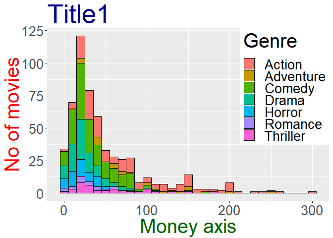<!-- -->

