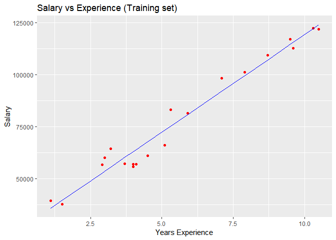
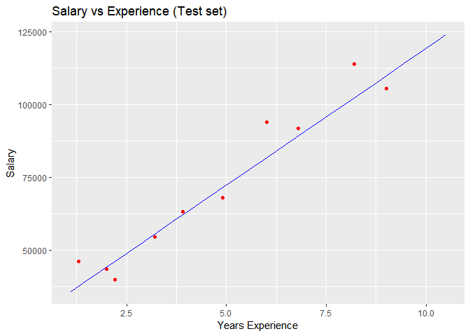
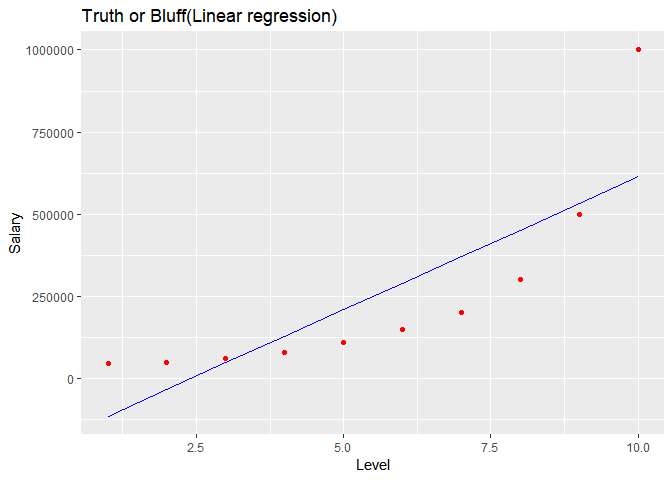
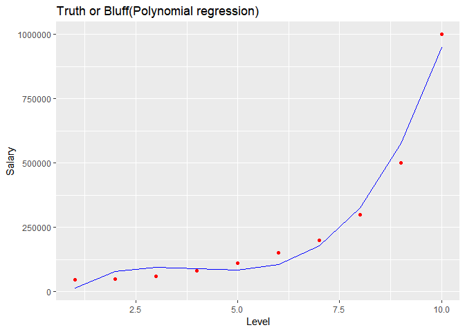
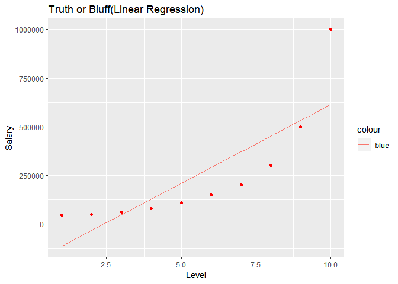
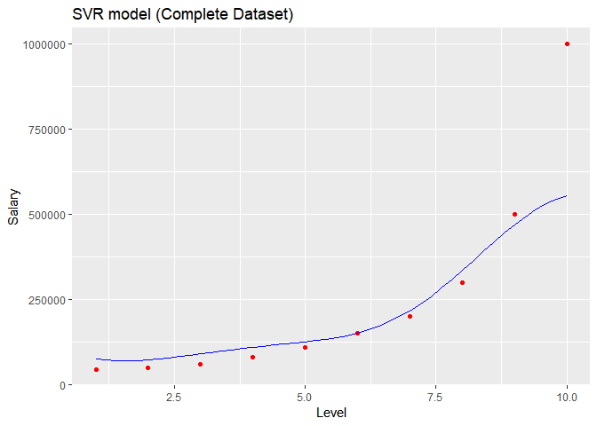
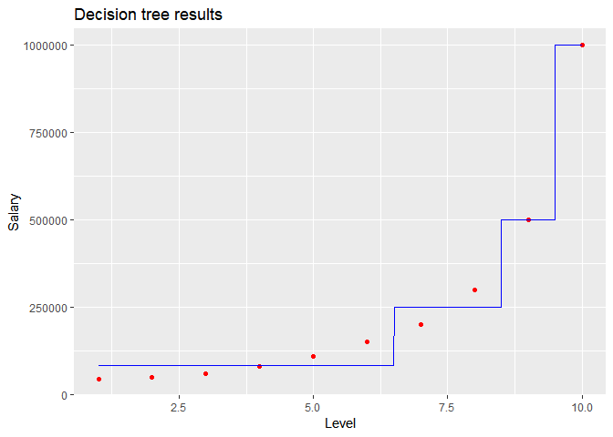

---
title: "Regression_methods_in_R"
output: 
  html_document: 
    keep_md: yes
---


Data Preprocessing----------------------------------------------------------------------------------------


```r
dataset=read.csv('Data.csv')
# Taking care of missing data
dataset$Age=ifelse(is.na(dataset$Age),ave(dataset$Age,FUN = function(x) mean(x,na.rm=TRUE)),dataset$Age)
dataset$Salary=ifelse(is.na(dataset$Salary),ave(dataset$Salary,
                                                FUN= function(x) mean(x,na.rm=TRUE)),dataset$Salary)

# Encoding categorical variables
dataset$Country=factor(dataset$Country,
                       levels=c('France','Spain','Germany'),
                       labels=c(1,2,3))
dataset$Purchased=factor(dataset$Purchased,
                       levels=c('No','Yes'),
                       labels=c(0,1))

#Split the dataset into training and testing
#install.packages("caTools")
library(caTools)
set.seed(123)
Split=sample.split(dataset$Purchased,SplitRatio = 2/3)
training_set=subset(dataset,Split==TRUE)
test_set=subset(dataset,Split==FALSE)

# feature scaling 
training_set[,2:3]=scale(training_set[,2:3])
test_set[,2:3]=scale(test_set[,2:3])

# look at the structure of dataset
str(dataset)
```

```
## 'data.frame':	10 obs. of  4 variables:
##  $ Country  : Factor w/ 3 levels "1","2","3": 1 2 3 2 3 1 2 1 3 1
##  $ Age      : num  44 27 30 38 40 ...
##  $ Salary   : num  72000 48000 54000 61000 63778 ...
##  $ Purchased: Factor w/ 2 levels "0","1": 1 2 1 1 2 2 1 2 1 2
```

```r
# remove dataset
rm(dataset)
```


Simple Linear Regression----------------------------------------------------------------------------------


```r
# Simple Linear Regression
# Read dataset
dataset=read.csv("Salary_Data.csv")
head(dataset)
```

```
##   YearsExperience Salary
## 1             1.1  39343
## 2             1.3  46205
## 3             1.5  37731
## 4             2.0  43525
## 5             2.2  39891
## 6             2.9  56642
```

```r
#Split the dataset into training and testing
#install.packages("caTools")
library(caTools)
set.seed(123)
Split=sample.split(dataset$Salary,SplitRatio = 2/3)
training_set=subset(dataset,Split==TRUE)
test_set=subset(dataset,Split==FALSE)

# feature scaling (not required for simple linear regression)
# training_set[,2:3]=scale(training_set[,2:3])
# test_set[,2:3]=scale(test_set[,2:3])

str(test_set)
```

```
## 'data.frame':	10 obs. of  2 variables:
##  $ YearsExperience: num  1.3 2 2.2 3.2 3.9 4.9 6 6.8 8.2 9
##  $ Salary         : num  46205 43525 39891 54445 63218 ...
```

```r
# Fitting simple linear regression to the training set

regressor=lm(formula = Salary~YearsExperience,data=training_set)
summary(regressor)
```

```
## 
## Call:
## lm(formula = Salary ~ YearsExperience, data = training_set)
## 
## Residuals:
##     Min      1Q  Median      3Q     Max 
## -7325.1 -3814.4   427.7  3559.7  8884.6 
## 
## Coefficients:
##                 Estimate Std. Error t value Pr(>|t|)    
## (Intercept)        25592       2646   9.672 1.49e-08 ***
## YearsExperience     9365        421  22.245 1.52e-14 ***
## ---
## Signif. codes:  0 '***' 0.001 '**' 0.01 '*' 0.05 '.' 0.1 ' ' 1
## 
## Residual standard error: 5391 on 18 degrees of freedom
## Multiple R-squared:  0.9649,	Adjusted R-squared:  0.963 
## F-statistic: 494.8 on 1 and 18 DF,  p-value: 1.524e-14
```

```r
# Predicting the test set results
prediction=predict(regressor,newdata = test_set)
head(prediction)
```

```
##        2        4        5        8       11       16 
## 37766.77 44322.33 46195.35 55560.43 62115.99 71481.07
```

```r
str(prediction)
```

```
##  Named num [1:10] 37767 44322 46195 55560 62116 ...
##  - attr(*, "names")= chr [1:10] "2" "4" "5" "8" ...
```

```r
head(test_set)
```

```
##    YearsExperience Salary
## 2              1.3  46205
## 4              2.0  43525
## 5              2.2  39891
## 8              3.2  54445
## 11             3.9  63218
## 16             4.9  67938
```

```r
typeof(test_set)
```

```
## [1] "list"
```

```r
typeof(prediction)
```

```
## [1] "double"
```

```r
# Visualizing the training set results

library(ggplot2)

ggplot()+
  geom_point(aes(x=training_set$YearsExperience,y=training_set$Salary),color='red')+ geom_line(aes(x=training_set$YearsExperience,y=predict(regressor,newdata=training_set)),
           color='blue')+
  ggtitle("Salary vs Experience (Training set)")+
 xlab("Years Experience")+
 ylab("Salary")
```

<!-- -->

```r
# Visualizing the test set results

library(ggplot2)

ggplot()+
  geom_point(aes(x=test_set$YearsExperience,y=test_set$Salary),color='red')+ geom_line(aes(x=training_set$YearsExperience,y=predict(regressor,newdata=training_set)),
           color='blue')+
  ggtitle("Salary vs Experience (Test set)")+
 xlab("Years Experience")+
 ylab("Salary")
```

<!-- -->

Multiple Linear Regression---------------------------------------------------------------------------------

```r
# Multiple Linear Regression

# Import dataset
dataset=read.csv('50_Startups.csv')

# Encode categorical variables
head(dataset)
```

```
##   R.D.Spend Administration Marketing.Spend      State   Profit
## 1  165349.2      136897.80        471784.1   New York 192261.8
## 2  162597.7      151377.59        443898.5 California 191792.1
## 3  153441.5      101145.55        407934.5    Florida 191050.4
## 4  144372.4      118671.85        383199.6   New York 182902.0
## 5  142107.3       91391.77        366168.4    Florida 166187.9
## 6  131876.9       99814.71        362861.4   New York 156991.1
```

```r
dataset$State=factor(dataset$State ,
                     levels=c('New York','California','Florida'),
                     labels=c(1,2,3))

# Splitting to training and test dataset
library(caTools)
set.seed(123)
Split=sample.split(dataset$Profit,SplitRatio = 0.8)
training_set=subset(dataset,Split==TRUE)
test_set=subset(dataset,Split==FALSE)

# Feature scaling- not required for multiple linear regression
# training_set[,2:3]=scale(training_set[,2:3])
# test_set[,2:3]=scale(test_set[,2:3])

# Fit Multiple linear regression to the training set
#One way to write-regressor=lm(formula = Profit ~ R.D.Spend+Administration+Marketing.Spend+State,data=training_set)
# Another way if passing all variables as independent variables
regressor=lm(formula = Profit~.,data=training_set)
summary(regressor)
```

```
## 
## Call:
## lm(formula = Profit ~ ., data = training_set)
## 
## Residuals:
##    Min     1Q Median     3Q    Max 
## -33128  -4865      5   6098  18065 
## 
## Coefficients:
##                   Estimate Std. Error t value Pr(>|t|)    
## (Intercept)      4.965e+04  7.637e+03   6.501 1.94e-07 ***
## R.D.Spend        7.986e-01  5.604e-02  14.251 6.70e-16 ***
## Administration  -2.942e-02  5.828e-02  -0.505    0.617    
## Marketing.Spend  3.268e-02  2.127e-02   1.537    0.134    
## State2           1.213e+02  3.751e+03   0.032    0.974    
## State3           2.376e+02  4.127e+03   0.058    0.954    
## ---
## Signif. codes:  0 '***' 0.001 '**' 0.01 '*' 0.05 '.' 0.1 ' ' 1
## 
## Residual standard error: 9908 on 34 degrees of freedom
## Multiple R-squared:  0.9499,	Adjusted R-squared:  0.9425 
## F-statistic:   129 on 5 and 34 DF,  p-value: < 2.2e-16
```

```r
# Predicting the test set result
y_pred=predict(regressor,newdata=test_set)
```


Polynomial Regression----------------------------------------------------------------------------------

```r
# Polynomial Regression

dataset=read.csv('Position_Salaries.csv')
dataset=dataset[,2:3]
head(dataset)
```

```
##   Level Salary
## 1     1  45000
## 2     2  50000
## 3     3  60000
## 4     4  80000
## 5     5 110000
## 6     6 150000
```

```r
# Splitting the dataset into training and test set- not required as dataset is small
#library(caTools)
#set.seed(123)
#Split=sample.split(dataset$DependentVariable,SplitRatio = 0.8)
#training_set=subset(dataset,Split==TRUE)
#test_set=subset(dataset,split==FALSE)

# Feature scaling- not required in this case
#training_set=scale(training_set)
#test_set=scale(test_set)

# Fitting linear regression to the dataset
lin_reg=lm(formula= Salary~.,data=dataset)

# Fitting polynomial regression to the dataset
# first create polynomial variables that you desire
dataset$Level2=dataset$Level^2
dataset$Level3=dataset$Level^3

poly_reg=lm(formula=Salary~.,data=dataset)

# Visualizing the linear regression results
library(ggplot2)
ggplot()+
  geom_point(aes(x=dataset$Level,y=dataset$Salary),color='red')+
  geom_line(aes(x=dataset$Level,y=predict(lin_reg,newdata=dataset)),color='blue')+
  ggtitle("Truth or Bluff(Linear regression)")+
  xlab('Level')+
  ylab('Salary')
```

<!-- -->

```r
# Visualizing the polynomial regression results
ggplot()+
  geom_point(aes(x=dataset$Level,y=dataset$Salary),color='red')+
  geom_line(aes(x=dataset$Level,y=predict(poly_reg,newdata=dataset)),color='blue')+
  ggtitle("Truth or Bluff(Polynomial regression)")+
  xlab('Level')+
  ylab('Salary')
```

<!-- -->

```r
# Visualizing the polynomial regression results----- in higher resolution
x_grid=seq(min(dataset$Level),max(dataset$Level),0.1)
ggplot()+
  geom_point(aes(x=dataset$Level,y=dataset$Salary),color='red')+
  geom_line(aes(x=x_grid,y=predict(lin_reg,newdata=data.frame(Level=x_grid)),color='blue'))+
  ggtitle('Truth or Bluff(Linear Regression)')+
  xlab('Level')+
  ylab('Salary')
```

<!-- -->

```r
# Making prediction for a single point
y_pred=predict(lin_reg,data.frame(Level=6.5))
y_pred
```

```
##        1 
## 330378.8
```

```r
y_pred=predict(poly_reg,data.frame(Level=6.5,
                                   Level2=6.5^2,
                                   Level3=6.5^3))
y_pred
```

```
##        1 
## 133259.5
```

Support Vector regressor-----------------------------------------------------------------------------------

```r
# Support vector regressor-------------------------------------

dataset=read.csv('Position_Salaries_svr.csv')
dataset=dataset[,2:3]
head(dataset)
```

```
##   Level Salary
## 1     1  45000
## 2     2  50000
## 3     3  60000
## 4     4  80000
## 5     5 110000
## 6     6 150000
```

```r
# Splitting the dataset- not required for this due to small data
#library(caTools)
#set.seed(123)
#Split=sample.split(dataset$Salary,SplitRatio = 0.8)
#training_set=subset(dataset,Split==TRUE)
#test_set=subset(dataset,Split==FALSE)

# feature scaling
#training_set=scale(training_set)
#test_set=scale(test_set)

# Fit the regression model
#install.packages('e1071')
library(e1071)
# type of the model could be svm for classification-c type, or svr for regression- eps-regression type
regressor=svm(formula=Salary~.,data= dataset,type='eps-regression')
summary(regressor)
```

```
## 
## Call:
## svm(formula = Salary ~ ., data = dataset, type = "eps-regression")
## 
## 
## Parameters:
##    SVM-Type:  eps-regression 
##  SVM-Kernel:  radial 
##        cost:  1 
##       gamma:  1 
##     epsilon:  0.1 
## 
## 
## Number of Support Vectors:  6
```

```r
# predict for new point
y_pred=predict(regressor,data.frame(Level=6.5))
y_pred
```

```
##        1 
## 177861.1
```

```r
# plot for the complete data (in higher resolution)
x_grid=seq(min(dataset$Level),max(dataset$Level),0.2)
ggplot()+
  geom_point(aes(x=dataset$Level,y=dataset$Salary),color='red')+
  geom_line(aes(x=x_grid,y=predict(regressor,newdata=data.frame(Level=x_grid))),color='blue')+
  ggtitle("SVR model (Complete Dataset)")+
  xlab("Level")+
  ylab("Salary")
```

<!-- -->

Decision Tree Regression-----------------------------------------------------------------

```r
# Import same dataset as before- actually not required as its alredy imported before, but just for # completeness of code
dataset=read.csv('Position_Salaries.csv')
head(dataset)
```

```
##            Position Level Salary
## 1  Business Analyst     1  45000
## 2 Junior Consultant     2  50000
## 3 Senior Consultant     3  60000
## 4           Manager     4  80000
## 5   Country Manager     5 110000
## 6    Region Manager     6 150000
```

```r
dataset=dataset[,2:3]
head(dataset)
```

```
##   Level Salary
## 1     1  45000
## 2     2  50000
## 3     3  60000
## 4     4  80000
## 5     5 110000
## 6     6 150000
```

```r
# split the data- not required due to small size
# library(caTools)
# set.seed(123)
#Split=sample.split(dataset,SplitRatio = 0.8)
#training_set=subset(dataset,Split==TRUE)
#test_set=subset(dataset,Split==FALSE)

# scale the data - not required in this case
#training_set=scale(training_set)
#test_set=scale(test_set)

# Fit the decision tree
#install.packages('rpart')
library(rpart)
regressor=rpart(formula=Salary~.,data=dataset,control = rpart.control(minsplit = 1))
summary(regressor)
```

```
## Call:
## rpart(formula = Salary ~ ., data = dataset, control = rpart.control(minsplit = 1))
##   n= 10 
## 
##           CP nsplit  rel error   xerror      xstd
## 1 0.77638626      0 1.00000000 1.234568 0.7835133
## 2 0.15496716      1 0.22361374 1.193575 0.7875782
## 3 0.05217357      2 0.06864658 1.175533 0.7899676
## 4 0.01000000      3 0.01647301 1.175533 0.7899676
## 
## Variable importance
## Level 
##   100 
## 
## Node number 1: 10 observations,    complexity param=0.7763863
##   mean=249500, MSE=8.066225e+10 
##   left son=2 (8 obs) right son=3 (2 obs)
##   Primary splits:
##       Level < 8.5 to the left,  improve=0.7763863, (0 missing)
## 
## Node number 2: 8 observations,    complexity param=0.05217357
##   mean=124375, MSE=6.921484e+09 
##   left son=4 (6 obs) right son=5 (2 obs)
##   Primary splits:
##       Level < 6.5 to the left,  improve=0.7600316, (0 missing)
## 
## Node number 3: 2 observations,    complexity param=0.1549672
##   mean=750000, MSE=6.25e+10 
##   left son=6 (1 obs) right son=7 (1 obs)
##   Primary splits:
##       Level < 9.5 to the left,  improve=1, (0 missing)
## 
## Node number 4: 6 observations
##   mean=82500, MSE=1.38125e+09 
## 
## Node number 5: 2 observations
##   mean=250000, MSE=2.5e+09 
## 
## Node number 6: 1 observations
##   mean=500000, MSE=0 
## 
## Node number 7: 1 observations
##   mean=1000000, MSE=0
```

```r
# predict for new point
y_pred=predict(regressor, newdata=data.frame(Level=6.5))
y_pred
```

```
##      1 
## 250000
```

```r
# Visualize the results- in high resolution
head(dataset)
```

```
##   Level Salary
## 1     1  45000
## 2     2  50000
## 3     3  60000
## 4     4  80000
## 5     5 110000
## 6     6 150000
```

```r
x_grid=seq(min(dataset$Level),max(dataset$Level),0.01)
ggplot()+
  geom_point(aes(x=dataset$Level,y=dataset$Salary),color='red')+
  geom_line(aes(x=x_grid,y=predict(regressor,newdata=data.frame(Level=x_grid))),color='blue')+
  ggtitle("Decision tree results")+
  xlab("Level")+
  ylab("Salary")
```

<!-- -->

```r
# Dataset is already imported, so I'll skip that step
dataset=read.csv('Position_Salaries.csv')
head(dataset)
```

```
##            Position Level Salary
## 1  Business Analyst     1  45000
## 2 Junior Consultant     2  50000
## 3 Senior Consultant     3  60000
## 4           Manager     4  80000
## 5   Country Manager     5 110000
## 6    Region Manager     6 150000
```

```r
dataset=dataset[,2:3]
head(dataset)
```

```
##   Level Salary
## 1     1  45000
## 2     2  50000
## 3     3  60000
## 4     4  80000
## 5     5 110000
## 6     6 150000
```

```r
# Division into training test not required, due to small data size
# library(caTools)
# set.seed(123)
# Split=sample.split(dataset,SplitRatio = 0.8)
# training_set=subset(dataset,Split==TRUE)
# test_set=subset(dataset,Split==FALSE)

# Fit RF regressor
#install.packages('randomForest')
library(randomForest)
```

```
## randomForest 4.6-14
```

```
## Type rfNews() to see new features/changes/bug fixes.
```

```
## 
## Attaching package: 'randomForest'
```

```
## The following object is masked from 'package:ggplot2':
## 
##     margin
```

```r
set.seed(123)
regressor=randomForest(x=dataset[1],
                       y=dataset$Salary,
                       ntree=100
                       )


# predict for new point
y_pred=predict(regressor, newdata=data.frame(Level=6.5))
y_pred
```

```
##        1 
## 163104.2
```

```r
# Visualize the results- in high resolution
head(dataset)
```

```
##   Level Salary
## 1     1  45000
## 2     2  50000
## 3     3  60000
## 4     4  80000
## 5     5 110000
## 6     6 150000
```

```r
x_grid=seq(min(dataset$Level),max(dataset$Level),0.01)
ggplot()+
  geom_point(aes(x=dataset$Level,y=dataset$Salary),color='red')+
  geom_line(aes(x=x_grid,y=predict(regressor,newdata=data.frame(Level=x_grid))),color='blue')+
  ggtitle("Random Forest results")+
  xlab("Level")+
  ylab("Salary")
```

<!-- -->

