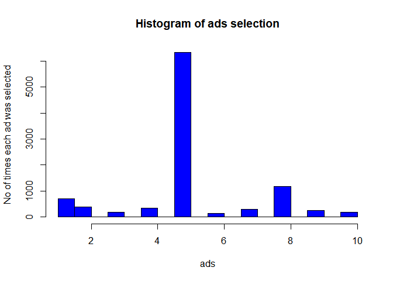
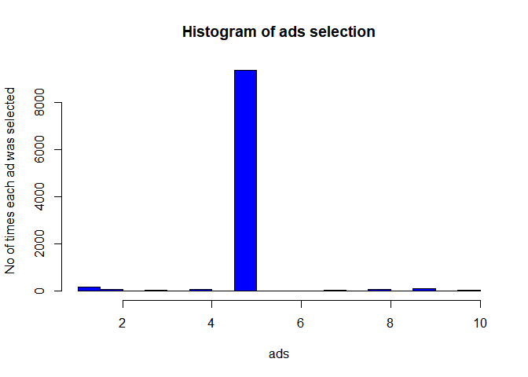

Reinforcement Learning is a branch of ML also called Online learning. It is used to solve interacting problems where the data observed up to time t is considered to decide which action to take at time t+1. It is also used for AI when training machines to perform tasks such as walking. Desired outcomes provide the AI with reward, undesired with punishment. Machines learn through trial and error.

Upper Confidence Bound-------------------------------------------------------------------------------------

UCB algorithm is deterministic and requires an update after every round


```r
# Import the dataset
dataset=read.csv('Ads_CTR_Optimisation.csv')
head(dataset)
```

```
##   Ad.1 Ad.2 Ad.3 Ad.4 Ad.5 Ad.6 Ad.7 Ad.8 Ad.9 Ad.10
## 1    1    0    0    0    1    0    0    0    1     0
## 2    0    0    0    0    0    0    0    0    1     0
## 3    0    0    0    0    0    0    0    0    0     0
## 4    0    1    0    0    0    0    0    1    0     0
## 5    0    0    0    0    0    0    0    0    0     0
## 6    1    1    0    0    0    0    0    0    0     0
```

```r
str(dataset)
```

```
## 'data.frame':	10000 obs. of  10 variables:
##  $ Ad.1 : int  1 0 0 0 0 1 0 1 0 0 ...
##  $ Ad.2 : int  0 0 0 1 0 1 0 1 0 0 ...
##  $ Ad.3 : int  0 0 0 0 0 0 0 0 0 1 ...
##  $ Ad.4 : int  0 0 0 0 0 0 1 0 0 0 ...
##  $ Ad.5 : int  1 0 0 0 0 0 0 1 0 0 ...
##  $ Ad.6 : int  0 0 0 0 0 0 0 0 0 0 ...
##  $ Ad.7 : int  0 0 0 0 0 0 0 0 0 0 ...
##  $ Ad.8 : int  0 0 0 1 0 0 0 0 0 0 ...
##  $ Ad.9 : int  1 1 0 0 0 0 0 0 0 0 ...
##  $ Ad.10: int  0 0 0 0 0 0 0 0 0 0 ...
```

```r
# Implement the UCB
N=10000 # Corresponding to 10000 rows in dataset/ 10000 persons on which the ads are tested
d= 10 # Corresponding to number of columns in dataset/ 10 ads to be compared
ads_selected=integer(0)
no_of_selected=integer(d)
rewards_for_ads=integer(d)
total_rewards=0
for (n in 1:N){
    ad=0
    max_up_bound=0
    for (i in 1:d){
    if (no_of_selected[i]>0){
      avg_reward=rewards_for_ads[i]/no_of_selected[i]
      delta=sqrt(3/2*log(n)/no_of_selected[i])
      upper_bound=avg_reward+delta
    }     else{
      upper_bound=1e400
    }
      
    if (upper_bound>max_up_bound)
      {
        max_up_bound=upper_bound
        ads=i
      }
  
  }
  ads_selected=append(ads_selected,ads)
  no_of_selected[ads]=no_of_selected[ads]+1
  reward=dataset[n,ads]
  rewards_for_ads[ads]=rewards_for_ads[ads]+reward
  total_rewards=total_rewards+reward
}


total_rewards
```

```
## [1] 2178
```

```r
no_of_selected
```

```
##  [1]  705  387  186  345 6323  150  292 1170  256  186
```

```r
rewards_for_ads
```

```
##  [1]  120   47    7   38 1675    1   27  236   20    7
```

```r
# Visualizing the results- histogram
hist(ads_selected,
     col='blue',
     main= 'Histogram of ads selection',
     xlab='ads',
     ylab='No of times each ad was selected'
     )
```

<!-- -->


Thompson Sampling------------------------------------------------------------------------------------------

Thompson Sampling is probabilistic and can accomodate delayed feedback.


```r
# Import the dataset
dataset=read.csv('Ads_CTR_Optimisation.csv')

# Implement the Thompson Sampling
N=10000 # Corresponding to 10000 rows in dataset/ 10000 persons on which the ads are tested
d= 10 # Corresponding to number of columns in dataset/ 10 ads to be compared
ads_selected=integer(0)
number_of_rewards_1=integer(d)
number_of_rewards_0=integer(d)
total_rewards=0
for (n in 1:N){
    ad=0
    max_random=0
    for (i in 1:d){
    random_beta=rbeta(n=1,
                      shape1=number_of_rewards_1[i]+1,
                      shape2=number_of_rewards_0[i]+1
                      )
    if (random_beta>max_random)
      {
        max_random=random_beta
        ad=i
      }
  
  }
  ads_selected=append(ads_selected,ad)
  reward=dataset[n,ad]
  if (reward==1){
    number_of_rewards_1[ad]=number_of_rewards_1[ad]+1
  } else {
    number_of_rewards_0[ad]=number_of_rewards_0[ad]+1
      }
  
  total_rewards=total_rewards+reward
}


total_rewards
```

```
## [1] 2591
```

```r
# Visualizing the results- histogram
hist(ads_selected,
     col='blue',
     main= 'Histogram of ads selection',
     xlab='ads',
     ylab='No of times each ad was selected'
     )
```

<!-- -->

